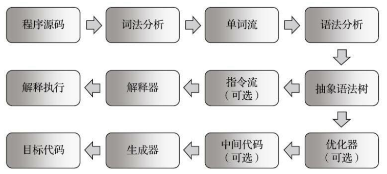

# 基于栈的字节码解释执行引擎&emsp;  
&emsp;  
## 解释执行&emsp;  
&emsp;  
​&emsp;&emsp; Java 代码的时候都有**解释执行（通过解释器执行）**和**编译执行（通过即时编译器产生本地代码执行）**两种选择。&emsp;  
&emsp;  
​&emsp;&emsp;Java 语言经常被人们定位为解释执行的语言，在 Java 初生的 JDK 1.0 时代，这种定义还算是比较准确的，但当主流的虚拟机中都包含了**即时编译器**后， Class 文件中的代码到底会被解释执行还是编译执行，就成了只有虚拟机自己才能准确判断的事。再后来， Java 也发展出可以直接生成本地代码的编译器（如 Jaotc、 GCJ， Excelsior JET），这时候再笼统地说解释执行，对于整个 Java 语言来说就成了几乎是没有意义的概念，只有确定了谈论对象是某种具体的 Java 实现版本和执行引擎运行模式时，谈解释执行还是编译执行才会比较合理确切。&emsp;  
&emsp;  
​&emsp;&emsp;大部分的程序代码转换成物理机的目标代码或虚拟机能执行的指令集之前，都要经过以下步骤：&emsp;  
&emsp;  
&emsp;  
&emsp;  
​&emsp;&emsp;在 Java 语言中， Javac 编译器完成了程序代码经过词法分析、语法分析到抽象语法树，再遍历语法树生成线性的字节码指令流的过程。因为这一部分动作是在 Java 虚拟机之外进行的，而解释器在虚拟机的内部，所以 Java 程序的**编译**就是**半独立**的实现。&emsp;  
&emsp;  
## 基于栈的指令集&emsp;  
&emsp;  
​&emsp;&emsp;Javac 编译器输出的字节码指令流，基本上是一种基于栈的指令集架构（Instruction Set Architecture， ISA），字节码指令流里面的指令大部分都是零操作数指令，操作数都放在操作数栈中。 &emsp;  
&emsp;  
**优点：**&emsp;  
&emsp;  
1. **可移植性强**。&emsp;  
&emsp;  
   ​&emsp;&emsp;基于寄存器的指令集的寄存器由硬件直接提供，程序直接依赖这些硬件寄存器则不可避免地要受到硬件的约束。所以基于栈的指令集可移植更强。&emsp;  
&emsp;  
2. **代码相对更加紧凑**。&emsp;  
&emsp;  
   ​&emsp;&emsp;字节码中每个字节就对应一条指令，而多地址指令集中还需要存放参数。&emsp;  
&emsp;  
3. **编译器实现更加简单**。&emsp;  
&emsp;  
   ​&emsp;&emsp;不需要考虑空间分配的问题，所需空间都在栈上操作。&emsp;  
&emsp;  
**缺点：**&emsp;&emsp;  
&emsp;  
1. 完成相同功能所需的指令数量一般会比寄存器架构来得更多。&emsp;  
&emsp;  
   ​&emsp;&emsp;相对于基于寄存器的指令集，基于栈的指令集会多处很多出栈、入栈操作的指令。&emsp;  
&emsp;  
2. 性能较弱。&emsp;  
&emsp;  
   ​&emsp;&emsp;频繁的栈访问也就意味着频繁的内存访问，而相对于处理器来说，内存始终是执行速度的瓶颈。&emsp;  
&emsp;  
​&emsp;&emsp;基于栈的指令运行的模型只是一个概念模型，虚拟机最终会对执行过程做出一系列优化来提高性能，实际的运作过程并不会完全符合概念模型的描述。&emsp;  
&emsp;  
&emsp;  
