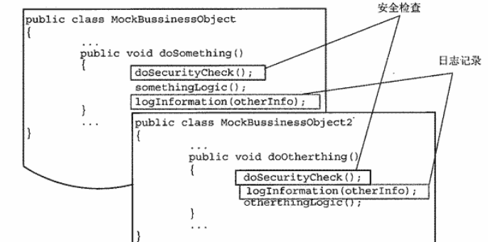
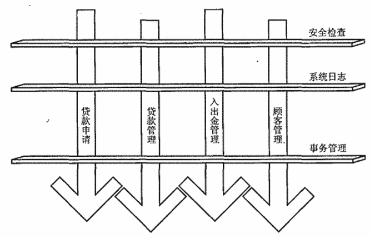
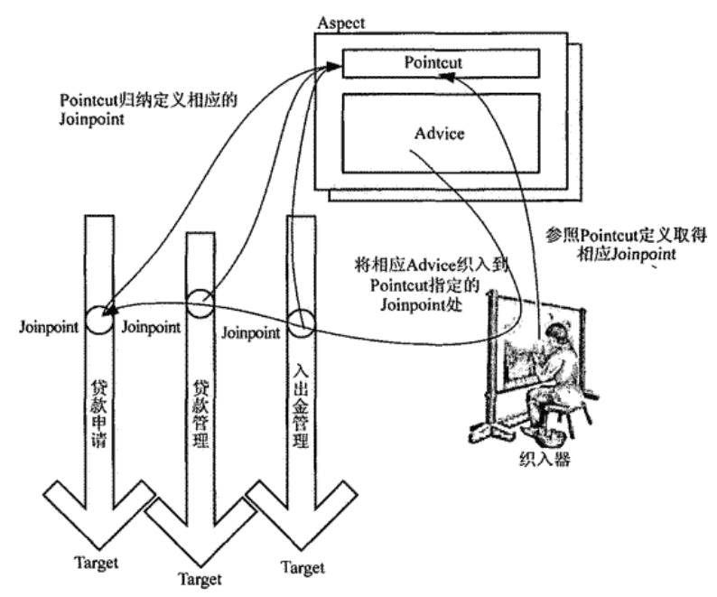

# AOP基础概念&emsp;  
&emsp;  
## AOP的概念&emsp;  
&emsp;  
​&emsp;&emsp;若在一个Java项目中，有很多的类都需要运行一些相同的方法，比如日志记录，安全检查等对所有类进行统一维护的操作，当这些方法逐渐增多时，就会变得很繁琐。&emsp;  
&emsp;  
&emsp;  
&emsp;  
​&emsp;&emsp;这些方法就像一个横切面，将每一个方法统一的切开。&emsp;  
&emsp;  
&emsp;  
&emsp;  
​&emsp;&emsp;AOP（Aspect-Oriented Programming），的翻译为**面向切面编程**，中的切面就是指这些方法组成的切面。AOP可以很好的解决以上的方法逐渐增多时，变得很繁琐的问题。&emsp;  
&emsp;  
## AOP相关概念&emsp;  
&emsp;  
&emsp;  
&emsp;  
### 织入和织入器&emsp;  
&emsp;  
​&emsp;&emsp;织入就是将切面插入的过程，织入过程由织入器完成&emsp;  
&emsp;  
### Joinpoint&emsp;  
&emsp;  
​&emsp;&emsp;Joinpoint用来描述系统将在那行代码的位置进行织入。&emsp;  
&emsp;  
可大致分为以下几种类型：&emsp;  
&emsp;  
- **方法调用**&emsp;  
&emsp;  
  当某个方法被调用的时候所处的程序执行点，是在调用对象上的执行点&emsp;  
&emsp;  
- **方法执行**&emsp;  
&emsp;  
  某个方法内部执行开始的程序执行点，是在被调用的方法内部的执行点&emsp;  
&emsp;  
- **构造方法调用**&emsp;  
&emsp;  
  程序执行时，对某个对象构造方法进行初始化的执行点&emsp;  
&emsp;  
- **构造方法执行**&emsp;  
&emsp;  
  某个对象构造方法内部开始初始化的程序执行点&emsp;  
&emsp;  
- **字段设置**&emsp;  
&emsp;  
  某个对象的某个属性被赋值的程序执行点&emsp;  
&emsp;  
- **字段获取**&emsp;  
&emsp;  
  某个对象的某个属性被访问的程序执行点&emsp;  
&emsp;  
- **异常处理执行**&emsp;  
&emsp;  
  某些异常抛出后，对应的异常处理逻辑执行的时点&emsp;  
&emsp;  
- **类初始化**&emsp;  
&emsp;  
  某个类被第一次初始化时，静态类型或静态代码块的初始化的程序执行点。&emsp;  
&emsp;  
### Pointcut&emsp;  
&emsp;  
​&emsp;&emsp;代表的是 **Joinpoint的描述**，将横切逻辑值如当前系统的过程中，需要参照 Pointcut规定的Joinpoint信息，才可以知道应该往系统的那些位置织入横切逻辑。&emsp;  
&emsp;  
​&emsp;&emsp;常用的Pintcut的表述方式：&emsp;  
&emsp;  
- **指定 Joinpoint所在的方法名称**：&emsp;  
&emsp;  
  比较简单，但功能单一。只适用于方法调用和方法执行类型的 Joinpoint。&emsp;  
&emsp;  
- **正则表达式**：&emsp;  
&emsp;  
  比较普遍的 Pointcut的表述方式，功能强大。&emsp;  
&emsp;  
- **特定的 Pointcut表述语言**&emsp;  
&emsp;  
  即设计一个表述语言来描述 Pointcut，功能强大，灵活性好，但实现较为复杂。&emsp;  
&emsp;  
​&emsp;&emsp;Pointcut还支持**逻辑运算**，通过逻辑运算，由简单的 Pointcut生成较为复杂的 Pointcut&emsp;  
&emsp;  
### Advice&emsp;  
&emsp;  
​&emsp;&emsp;代表切面中执行的方法，由程序员定义的方法，表明了将会织入到 Joinpoint中的横切逻辑。&emsp;  
&emsp;  
具体分为以下几类：&emsp;  
&emsp;  
- Before Advice&emsp;  
&emsp;  
  Before Advice会在 **Joinpoint指定位置之前**执行 Advice类型。可以使用Before Advice做一些系统初始化操作。&emsp;  
&emsp;  
- After Advice&emsp;  
&emsp;  
  After Advice会在 **Joinpoint指定位置之后**执行 Advice类型。细分为以下三种：&emsp;  
&emsp;  
  - After returning Advice&emsp;  
&emsp;  
    只有当前 Jointpoint处执行流程**正常完成**后才执行&emsp;  
&emsp;  
  - After throwing Advice&emsp;  
&emsp;  
    只有当前 Jointpoint处执行流程**抛出异常**后才执行&emsp;  
&emsp;  
  - After Advice &emsp;  
&emsp;  
    不管是正常完成还是抛出异常，都会执行。&emsp;  
&emsp;  
- Around Advice&emsp;  
&emsp;  
  在一个 **Joinpoint之前和之后**都指定相应的逻辑。&emsp;  
&emsp;  
- Introduction&emsp;  
&emsp;  
  可以为原有的**对象添加新的特性或者行为**。&emsp;  
&emsp;  
### Aspect&emsp;  
&emsp;  
​&emsp;&emsp;Aspect是对系统中的**横切关注点**逻辑进行模块化封装的**AOP概念实体**&emsp;  
&emsp;  
### 目标对象&emsp;  
&emsp;  
​&emsp;&emsp;在织入过程中被织入横切逻辑的对象&emsp;  
&emsp;  
&emsp;  
&emsp;  
&emsp;  
