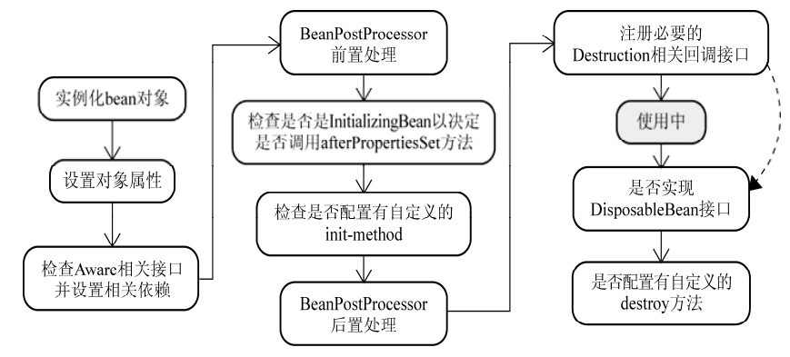
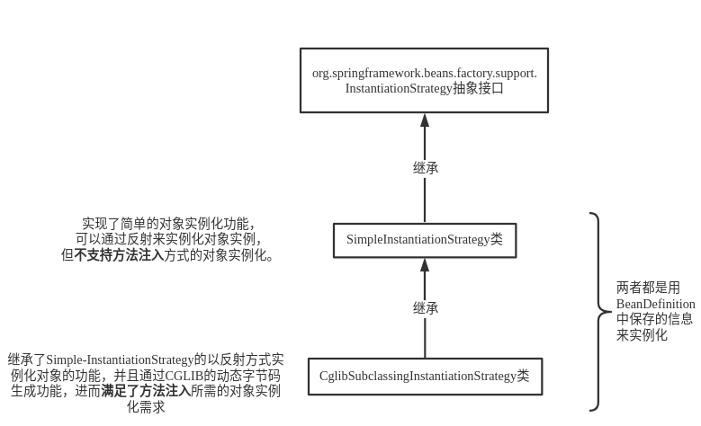
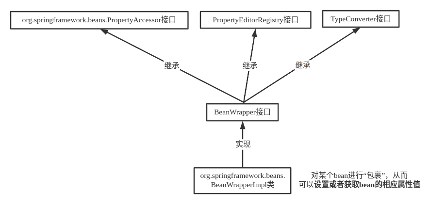
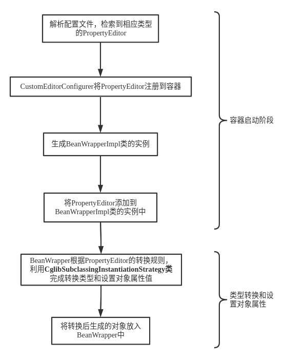

# Bean的实例化过程&emsp;  
&emsp;  
&emsp;  
&emsp;  
## 1. **实例化bean对象**&emsp;  
&emsp;  
对象的实例化可以通过以下两个类来实现。&emsp;  
&emsp;  
&emsp;  
&emsp;  
## **2. 类型转换与设置对象属性**&emsp;  
&emsp;  
实例化之后，返回的并不是一个对象，而是一个包裹此实例的BeanWrapper对象。&emsp;  
&emsp;  
&emsp;  
&emsp;  
​&emsp;&emsp;流程：&emsp;  
&emsp;  
&emsp;  
&emsp;  
## **3. 检查Aware相关接口，并设置相关依赖**&emsp;  
&emsp;  
​&emsp;&emsp;Spring容器会检查当前对象实例是否实现了一系列的以Aware命名结尾的接口。如果是，则将这些Aware接口定义中规定的依赖注入给当前对象实例，因为接口内均定义了一个set方法用于注入。&emsp;  
&emsp;  
​&emsp;&emsp;`aware`是**已感知的**，意识到的意思。所以`Aware`接口是为了能够**感知到自身的一些属性**。单纯的bean（未实现Aware系列接口）是没有知觉的，实现了Aware系列接口的bean可以**访问Spring容器**，这些Aware系列接口增强了Spring bean的功能。&emsp;  
&emsp;  
​&emsp;&emsp;例如org.springframework.beans.factory.BeanNameAware接口，此接口有一个 setBeanName(String beanName)方法，beanName就是在 xml文件中设置访问Spring容器的 bean的id值，以此bean访问到了容器，获取了 bean在xml中设置的id。&emsp;  
&emsp;  
## **4. BeanPostProcessor的前置处理与后置处理**&emsp;  
&emsp;  
```java
public interface BeanPostProcessor{
    // 前置处理。实例化和依赖注入完毕，在调用显示的初始化 之前 完成一些定制的初始化任务  
	Object postProcessBeforeInitialization(Object bean, String beanName) throws 		BeansException;
    
    // 后置处理。实例化、依赖注入和初始化 完毕 时执行 
	Object postProcessAfterInitialization(Object bean, String beanName) throws 
	BeansException;   
}
```
&emsp;  
​&emsp;&emsp;若容器中有一个BeanPostProcessor的实例，则将容器中的所有实例传入这两个方法，参数中 bean即为传入的实例。几乎可以对传入的对象实例执行任何的操作。&emsp;  
&emsp;  
​&emsp;&emsp;当自定义一个实现BeanPostProcessor的类后，要利用配置文件（xml）将此类作为一个bean放入容器中才可以使其生效。&emsp;  
&emsp;  
## 5. **InitializingBean和init-method**&emsp;  
&emsp;  
#### &emsp;InitializingBean接口&emsp;  
&emsp;  
​&emsp;&emsp;若一个 bean实现了 InitializingBean接口，就会在BeanPostProcessor前置处理完成后，运行实现的afterPropertiesSet()方法，以达到辅助初始化的目的。&emsp;  
&emsp;  
#### &emsp;init-method&emsp;  
&emsp;  
​&emsp;&emsp;还可以利用 bean的 init-method属性来任意指定一个辅助初始化的方法，可以不必局限于afterPropertiesSet()方法。&emsp;  
&emsp;  
如：&emsp;  
&emsp;  
```java
public class TestInitializingBean{
    public void testInit(){
        System.out.println("ceshi init-method");        
    }
}
```
&emsp;  
```xml-dtd
<bean id="testInitializingBean" class="com.TestInitializingBean" init-method="testInit"> </bean>
```
&emsp;  
​&emsp;&emsp;如果一个bean是实现了InitializingBean接口，并且同时在配置文件中指定了init-method，系统则是**先调用afterPropertiesSet方法**，然后**再调用init-method**中指定的方法。&emsp;  
&emsp;  
​&emsp;&emsp;也可以在一个类上添加 **@Bean(initMethod = "testInit")** 来指定一个辅助初始化的方法。&emsp;  
&emsp;  
​&emsp;&emsp;或者在辅助初始化的方法方法上使用 @PostConstruct 注解&emsp;  
&emsp;  
## 6. DisposableBean与destroy-method&emsp;  
&emsp;  
#### &emsp;DisposableBean接口&emsp;  
&emsp;  
​&emsp;&emsp;若一个 singleton类型的 bean实现了 DisposableBean接口，为该实例注册一个用于对象销毁的回调（ Callback），以便在这些singleton类型的对象实例销毁之前，执行destroy()方法。由于singleton类型的 bean在容器关闭时才结束生命周期，所以destroy()方法在**容器关闭时才运行**。&emsp;  
&emsp;  
​&emsp;&emsp;prototype对象实例在容器实例化并返回给请求方之后，容器就不再管理这种类型对象实例的生命周期了，所以只考虑了 singleton类型的 bean。&emsp;  
&emsp;  
#### destroy-method&emsp;  
&emsp;  
​&emsp;&emsp;还可以利用 bean的 destroy-method属性来任意指定一个用于容器关闭前运行的方法，可以不必局限于destroy()方法。&emsp;  
&emsp;  
如：&emsp;  
&emsp;  
```java
public class TestDestroyBean{
    public void testDestroy(){
        System.out.println("Destroy bean");        
    }
}
```
&emsp;  
```xml-dtd
<bean id="TestDestroyBean" class="com.TestDestroyBean" destroy-method="testDestroy"> </bean>
```
&emsp;  
​&emsp;&emsp;也可以在一个类上添加 **@Bean(destroyMethod = "testDestroy")** 来指定一个用于销毁的方法。&emsp;  
&emsp;  
​&emsp;&emsp;或者在用于销毁的方法上使用 @PreDestroy 注解&emsp;&emsp;&emsp;  
&emsp;  
&emsp;  
