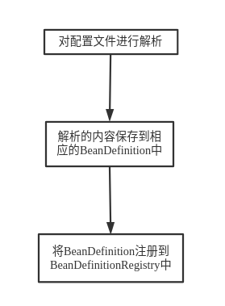

&emsp;  
&emsp;  
## 启动的过程&emsp;  
&emsp;  
&emsp;  
&emsp;  
​&emsp;&emsp;BeanDefintion定义了Bean在IoC容器内的基本数据结构，BeanDefinition描述了一个bean的实例，包括属性值，构造方法参数值和继承自它的类的更多信息，在Spring容器启动的过程中，会将Bean解析成Spring内部的BeanDefinition结构存储。&emsp;  
&emsp;  
## 启动中可以进行的操作&emsp;  
&emsp;  
​&emsp;&emsp;&emsp;Spring提供了一种叫做BeanFactoryPostProcessor的容器扩展机制。该机制允许我们在容器的启动过程中，对注册到容器的BeanDefinition所保存的信息做相应的修改。&emsp;  
&emsp;  
&emsp;  
&emsp;  
​&emsp;&emsp;CustomEditorConfigurer的功能较为复杂。&emsp;  
&emsp;  
​&emsp;&emsp;不管对象是什么类型，也不管这些对象所声明的依赖对象是什么类型，通常都是通过XML（或者properties甚至其他媒介）文件格式来配置这些对象类型。但**XML所记载的，都是String类型**，即容器从XML格式的文件中读取的都是字符串形式，最终应用程序却是由各种类型的对象所构成。要想完成这种**由字符串到具体对象的转换**（不管这个转换工作最终由谁来做），都需要这种转换规则相关的信息，而CustomEditor-Configurer就是帮助我们传达类似信息的。&emsp;  
&emsp;  
​&emsp;&emsp;Spring内部通过JavaBean的**PropertyEditor**来帮助进行String类型到其他类型的转换工作。对于每一种目标类型，都会有一种PropertyEditor与这种类型对相应，保存着String类型转换到这种类型的规则。例如 ClassEditor 保存着从**字符串的类名**转换到**具体实例**的信息，从而Spring可以将字符串变为一个 java对象。若是Spring自带的 PropertyEditor满足不了需求，则可以自定义一个 PropertyEditor，**CustomEditor-Configurer的作用**则是将实现的**PropertyEditor注册到容器**。&emsp;  
&emsp;  
​&emsp;&emsp;以上三个类**都可以进行自定义**，从而完成对Bean的修改。&emsp;  
&emsp;  
&emsp;  
