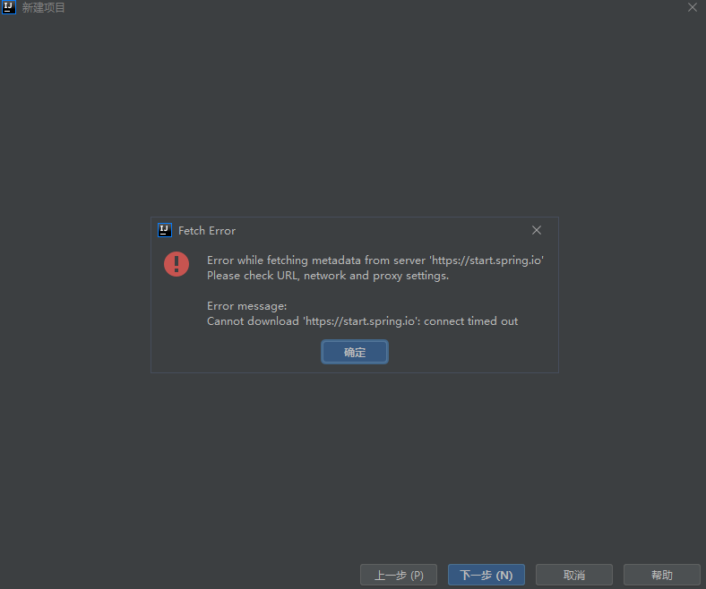

&emsp;  
&emsp;  
1. 在设置的插件中安装 **Spring Assistant 插件**&emsp;  
&emsp;  
   &emsp;  
&emsp;  
2. 利用 Spring Assistant 插件创建spring项目&emsp;  
&emsp;  
   &emsp;  
&emsp;  
   &emsp;  
&emsp;  
   若在使用默认的地址（https://start.spring.io/）时出现以下错误&emsp;  
&emsp;  
   &emsp;  
&emsp;  
   可以使用**阿里云**的地址：https://start.aliyun.com&emsp;  
&emsp;  
3. 打开 Spring Assistant 插件后，会有以下界面&emsp;  
&emsp;  
   &emsp;  
&emsp;  
   **Group Id：**&emsp;  
    &emsp;&emsp;GroupID是项目组织唯一的标识符，实D际对应JAVA的包的结构，是main目录里java的目录结构。定义了项目属于哪个组，举个例子，如果你的公司是mycom，有一个项目为myapp，那么groupId就应该是com.mycom.myapp.&emsp;  
&emsp;  
   **Artifact Id：**&emsp;  
    &emsp;&emsp;ArtifactID是项目的唯一的标识符，实际对应项目的名称，就是项目根目录的名称。定义了当前maven项目在组中唯一的ID,比如，myapp-util,myapp-domain,myapp-web等。&emsp;  
&emsp;  
   **Version：**&emsp;  
   &emsp;&emsp;指定了myapp项目的当前版本，SNAPSHOT意为快照，说明该项目还处于开发中，是不稳定的版本。&emsp;  
&emsp;  
   **Project name：**&emsp;  
   &emsp;&emsp;声明了一个对于用户更为友好的项目名称，不是必须的，推荐为每个pom声明name，以方便信息交流。&emsp;  
&emsp;  
   &emsp;  
&emsp;  
4. 点击下一步会有以下界面，可以**选择需要的功能**&emsp;  
&emsp;  
   &emsp;  
&emsp;  
   可以选择以下功能&emsp;  
&emsp;  
   开发工具：Spring Boot DevTools&emsp;  
&emsp;  
   wed：Spring Web&emsp;  
&emsp;  
   模板引擎：Thymeleaf&emsp;  
&emsp;  
   关系型数据库：MySQL Driver&emsp;  
&emsp;  
   &emsp;  
&emsp;  
5. 点击下一步后会有以下界面，选择项目名称和项目位置&emsp;  
&emsp;  
   &emsp;  
&emsp;  
6. 若在选择功能时选择了第一次使用的功能，此时以下文件会出现错误&emsp;  
&emsp;  
   &emsp;  
   &emsp;  
   若没有任何问题此时 IDEA 会自动下载缺少的东西&emsp;  
   &emsp;  
   若没有下载，可以点击 clean，然后在点击package，会开始下载&emsp;  
&emsp;  
&emsp;  
&emsp;  
​&emsp;若点击package后出现以下错误&emsp;  
&emsp;  
&emsp;  
&emsp;  
​&emsp;Could not transfer artifact ·····&emsp;  
&emsp;  
可以在maven的setting.xml文件中添加阿里云镜像&emsp;  
&emsp;  
    <mirrors>&emsp;  
        <mirror>&emsp;  
            <id>alimaven</id>&emsp;  
            <mirrorOf>central</mirrorOf>&emsp;  
            <name>aliyun maven</name>&emsp;  
            <url>http://maven.aliyun.com/nexus/content/repositories/central/</url>&emsp;  
        </mirror>&emsp;  
        <mirror>&emsp;  
            <id>alimaven</id>&emsp;  
            <name>aliyun maven</name>&emsp;  
            <url>http://maven.aliyun.com/nexus/content/groups/public/</url>&emsp;  
            <mirrorOf>central</mirrorOf>&emsp;  
        </mirror>&emsp;  
    </mirrors>&emsp;  
如果还不行可以在设置中的 VM选项中加入如下内容&emsp;  
&emsp;  
​&emsp;**-Dmaven.wagon.http.ssl.insecure=true -Dmaven.wagon.http.ssl.allowall=true**&emsp;  
&emsp;  
&emsp;  
&emsp;  
之后再次点击 clean 和 package 即可&emsp;  
&emsp;  
7. 若出现**不能解析springframework 解决方案**的错误时&emsp;  
&emsp;  
   可以在pom.xml配置文件中添加依赖&emsp;  
&emsp;  
   ```xml
   <dependency>
       <groupId>org.springframework.boot</groupId>
       <artifactId>spring-boot-starter-aop</artifactId>
   </dependency>
   ```
&emsp;  
   之后再次点击 clean 和 package 下载缺少的库&emsp;  
