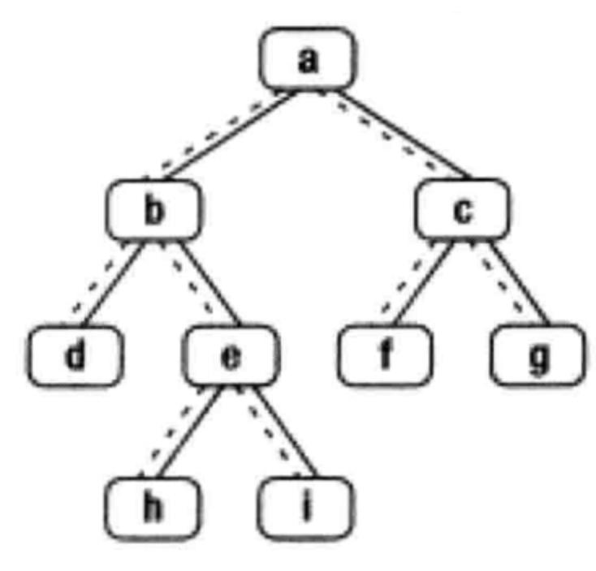

## 题目：&emsp;  
&emsp;  
​&emsp;&emsp;给定一个二叉树其中的一个结点，请找出中序遍历顺序的下一个结点并且返回。注意，树中的结点不仅包含左右子结点，同时包含指向父结点的next指针。下图为一棵有9个节点的二叉树。树中从父节点指向子节点的指针用实线表示，从子节点指向父节点的用虚线表示&emsp;  
&emsp;  
&emsp;  
&emsp;  
## 题解：&emsp;  
&emsp;  
**归纳总结法**&emsp;  
&emsp;  
 &emsp;  
&emsp;  
```
1 => 2 // 显然下一结点是 1 的父亲结点
2 => 3 // 下一节点是当前结点右孩子的左孩子结点，其实你也应该想到了，应该是一直到左孩子为空的那个结点
3 => 4 // 跟 2 的情况相似，当前结点右孩子结点的左孩子为空的那个结点
4 => 5 // 5 是父亲结点 3 的父亲结点，发现和1有点像，因为 1，3,同样是父亲结点的左孩子
5 => 6 // 跟 4=>5 一样的道理
6 => 7 // 跟 3=>4 一样的道理
7 => null // 因为属于最尾结点
```
&emsp;  
总结一下：&emsp;  
[1] 是一类：特点：当前结点是父亲结点的左孩子&emsp;  
[2 3 6] 是一类，特点：当前结点右孩子结点，那么下一节点就是：右孩子结点的最左孩子结点,如果右孩子结点没有左孩子就是自己&emsp;  
[4 5] 是一类，特点：当前结点为父亲结点的右孩子结点，本质还是[1]那一类&emsp;  
[7] 是一类，特点：最尾结点&emsp;  
&emsp;  
```java
class Solution {
public:
    TreeLinkNode* GetNext(TreeLinkNode* pNode)
    {
        if (!pNode) {
            return pNode;
        }

        // 属于[2 3 6]类
        if (pNode->right) {
            pNode = pNode->right;
            while (pNode->left) {
                pNode = pNode->left;
            }
            return pNode;
        }

        // 属于 [1] 和 [4 5]
        while (pNode->next) {
            TreeLinkNode *root = pNode->next;
            if (root->left == pNode) {
                return root;
            }
            pNode = pNode->next;
        }

        // 属于[7]
        return nullptr;
    }
};
```
&emsp;  
&emsp;  
