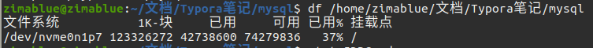
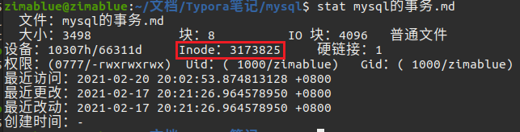
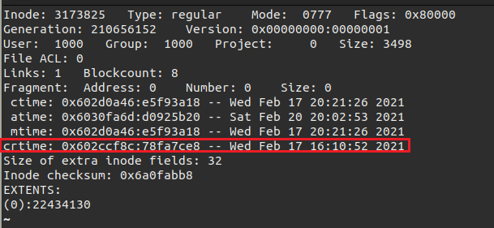

## Linux获取文件创建时间

1. 首先获取**文件所在目录的路径**，在**文件的属性**中可以得到
2. 然后利用 **df命令** 和刚才查找到的命令查询**文件所在磁盘路径**

```
df /home/zimablue/文档/Typora笔记/mysql
```

&emsp;&emsp;&emsp;&emsp;结果如下



&emsp;&emsp;&emsp;&emsp;可以得知文件所在磁盘路径为 /dev/nvme0n1p7

3. 接着利用 **stat 命令 **查询 **Inode** 值



&emsp;&emsp;&emsp;&emsp;Inode在第三行，为3173825

4. 最后利用 **debugfs** 查询出目标文件的创建时间

   ```
   sudo debugfs -R 'stat <Inode值>' 文件所在磁盘路径
   ```

   ```
   sudo debugfs -R 'stat <3173825>' /dev/nvme0n1p7
   ```

   结果如下
   
   
   
   &emsp;&emsp;crtime就是文件的创建时间

