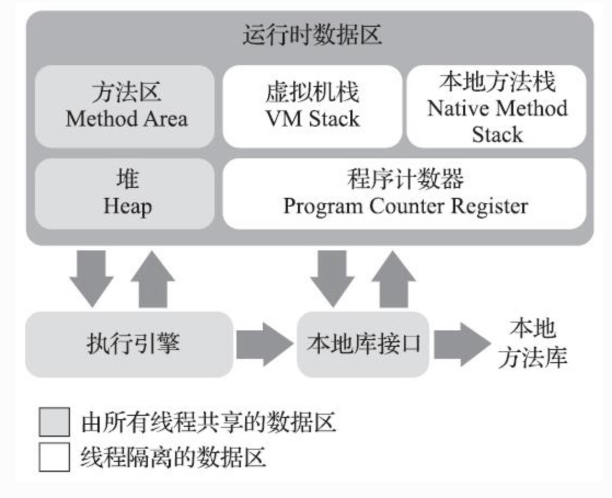

# Java虚拟机运行时数据区

## 程序计数器

1. 程序计数器是**当前线程所执行的字节码的行号指示器**，字节码解释器工作就是通过改变这个计数器的值来选取**下一条需要执行的字节码指令**。
2. Java虚拟机中每一条线程都有一个独立的程序计数器，称为**线程私有**的内存。
3. 线程中执行的若是 **Java方法**，则这个线程中的计数器记录的是**正在执行**的**虚拟机字节码指令的地址**。
4. 线程中执行的若是 **Native方法**，则这个线程中的**计数器为空**。
5. **Native方法**：此内存区域是唯一一个没有规定OutOfMemoryError情况的区域。被Native关键字声明的方法说明该方法**不是以Java语言实现的**，而是以本地语言实现的，Java可以直接拿来用，被称为**Native方法**。**本地语言**应该就是可以和操作系统直接交互的语言。因为Java无法直接访问到操作系统底层如硬件系统，所以需要由本地语言实现的Native方法。

## Java虚拟机栈

1. 同程序计数器一样，都是**线程私有**的，生命周期与线程相同。
2. Java虚拟机栈中存储的是**栈帧**，一个方法**被调用**，就表明方法对应的**栈帧入栈**，一个方法**运行完毕**，就表明方法对应的**栈帧出栈**。

3. **栈帧**用于存储**局部变量表**，**操作数栈**，**动态连接**，**方法出口**等信息

4. **局部变量表**：
   - **局部变量表**包括编译期可知的各种Java虚拟机**基本数据类型**的变量，**对象引用**（对象起始地址的引用指针等**代表对象位置**的引用）和**returnAddress类型**（指向一个**字节码指令的地址**）
   - 在**编译期间完成分配**，运行时并不会变化。
   - 局部变量表的存储空间以**局部变量槽**（Slot）来表示，64长度的long和double类型的数据会占用两个变量槽，其余数据类型只占用一个。
   - **局部变量槽的大小并不固定**，完全由虚拟机实现自行决定。所以**局部变量表的大小由局部变量槽的数量**来决定，而不是内存大小。
   - **变量槽的总数**并不是将方法中每个局部变量对应的变量槽的总和，不必要的变量槽数量会造成内存的浪费。Java 虚拟机的做法是将局部变量表中的变量槽进行重用，当代码执行超出一个局部变量的作用域时，这个局部变量所占的变量槽可以被其他局部变量所使用， Javac 编译器会根据变量的作用域来分配变量槽给各个变量使用，根据同时生存的最大局部变量数量和类型计算变量槽的总数。
   
7. 此内存区规定了两个异常
   - **StackOverflowError异常**：当线程**请求的栈深度大于虚拟机所允许的深度**时抛出此异常
   - **OutOfMemoryError异常**：当栈**申请不到足够的内存**时抛出此异常

## 本地方法栈

​		本地方法栈与虚拟机栈的作用相似，唯一的区别是虚拟机栈为Java方法提供服务，而本地方法栈**为本地方法提供服务**。

## Java堆

1. Java堆是虚拟机管理的**内存中最大的一块**

2. Java堆是**所有线程共享**的

3. 唯一目的是**存放对象实例**

4. Java堆是**垃圾收集器管理**的区域

5. 所有线程共享的 Java堆中可以划分出多个线程私有的分配**缓冲区**（Thread Local Allocation Buffer

   ，TLAB），以提升对象分配时的效率

6. Java堆可以处于**物理上不连续**的内存空间，但在**逻辑上必须是连续**的

7. Java堆既可以是**固定大小**的，也可以是**可拓展大小**的，**主流**的Java虚拟机都是**可拓展大小的**。
8. 若Java堆中**没有内存可以完成实例分配**，且**堆无法再拓展**，Java虚拟机就会抛出 **OutOfMemoryError异常**

### 方法区

1. 《Java虚拟机规范》中将方法区描述为**堆的一个逻辑部分**，但方法区也叫**非堆**（Non-Heap），用于两者的区分。
2. 用于存储已被虚拟机加载的**类型信息**（类等），**常量**，**静态变量**，即时编译器编译后的**代码缓存**等。
3. 是**所有线程共享**的。
4. 可以处于**物理上不连续**的内存空间，但在**逻辑上必须是连续**的。
5. 既可以是**固定大小**的，也可以是**可拓展大小**的。
6. **垃圾回收行为极少**在方法区**出现**，此区域内存回收的主要目标出要是针对**常量池的回收**和对**类型的卸载**。

#### 运行时常量池

1. 运行时常量池是**方法区的一部分**
2. Class文件除了有类的版本，字段，方法和接口等信息外，还有一项信息是**常量池表**，用于存放编译期生成的**各种字面量**与**符号引用**，这部分内容将在类加载后**存放到运行时常量池中**。
3. 运行时常量池**具有动态性**，并非预先置入Class文件中常量池的内容才能进入方法区运行时常量池，**运行期间也可以将新的常量放入**。
4. 当常量池申请不到内存时，会有 OutOfMemoryError异常

## 直接内存

1. 直接内存并不是虚拟机运行时数据区的一部分
2. JDK1.4中新加入了NIO（New Input/Output）类，引入了一种基于通道（Channel）与缓冲区（Buffer）的I/O方式，它**可以使用Native函数库直接分配堆外内存**，然后通过一个存储在**Java堆里面的DirectByteBuffer**对象**作为这块内存的引用**进行操作。这样能在一些场景中显著提高性能，因为避免了在Java堆和Native堆中来回复制数据。

