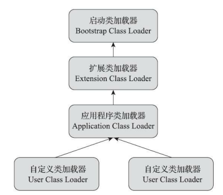
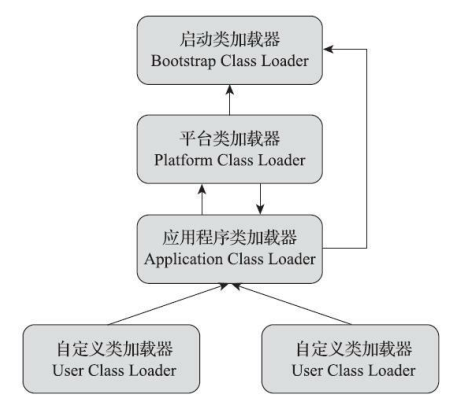

# 类加载器

## 类与类加载器

​		类加载器虽然只用于实现类的加载动作，但它在 Java 程序中起到的作用却远超类加载阶段。

​		<u>对于任意一个类，都必须由加载它的类加载器和这个类本身一起共同确立其在Java 虚拟机中的唯一性，每一个类加载器，都拥有一个独立的类名称空间</u>。也就是说，比较两个类是否“相等”，只有在这两个类是由同一个类加载器加载的前提下才有意义，否则，即使这两个类来源于同一个 Class 文件，被同一个 Java 虚拟机加载，只要加载它们的类加载器不同，那这两个类就必定不相等。

## 双亲委派模型

​		站在 Java 虚拟机的角度来看，只存在两种不同的类加载器：一种是**启动类加载器**（Bootstrap ClassLoader），这个类加载器使用 C++语言实现[1]，是虚拟机自身的一部分；另外一种就是**其他所有的类加载器**，这些类加载器都由 Java 语言实现，独立存在于虚拟机外部，并且全都继承自抽象类 java.lang.ClassLoader。

**双亲委派模型**：

- **启动类加载器：**

  ​		负责加载存放在 <JAVA_HOME>\lib 目录，或者被-Xbootclasspath 参数所指定的路径中存放的，而且是 Java 虚拟机能够识别的类库加载到虚拟机的内存中。启动类加载器无法被 Java 程序直接引用。

- **扩展类加载器：**

  ​		这个类加载器是在类sun.misc.Launcher$ExtClassLoader 中以 Java 代码的形式实现的。它负责加载
  <JAVA_HOME>\lib\ext 目录中，或者被 java.ext.dirs 系统变量所指定的路径中所有的类库，允许用户将具有通用性的类库放置在 ext 目录里以扩展 Java SE 的功能。

- **应用程序类加载器：**

  ​		负责加载用户类路径（ClassPath）上所有的类库，开发者同样可以直接在代码中使用这个类加载器。如果应用程序中没有**自定义的类加载器**，一般情况下这就是程序中默认的类加载器。

​		双亲委派模型要求除了顶层的启动类加载器外，其余的类加载器都应有自己的父类加载器。不过这里类加载器之间的父子关系一般不是以继承（ Inheritance）的关系来实现的，而是通常使用组合（Composition）关系来复用父加载器的代码。

​		**双亲委派模型的工作过程**是：如果<u>一个类发出加载另一个类的请求，首先请求的加载器是加载发出请求的类的加载器</u>，这个类加载器收到了类加载的请求，它首先不会自己去尝试加载这个类，而是<u>把这个请求委派给父类加载器去完成</u>，每一个层次的类加载器都是如此，因此所有的加载请求最终都应该传送到最顶层的启动类加载器中，只有当父加载器反馈自己无法完成这个加载请求（它的搜索范围中没有找到所需的类）时，子加载器才会尝试自己去完成加载。

​		双亲委派模型只能由子类加载器请求父类加载器，但若是有**父类加载器请求子类加载器**的需求，就只能使用**线程上下文类加载器**。这个类加载器可以通过 java.lang.Thread 类的 setContext-ClassLoader()方法进行设置，如果创建线程时还未设置，它将会从父线程中继承一个，如果在应用程序的全局范围内都没有设置过的话，那这个类加载器默认就是应用程序类加载器。

## 模块化下的类加载器

​		在 JDK 9 中引入的 Java 模块化系统（Java Platform Module System， JPMS），模块化下的类加载器也发生了一些变动。

**JDK 9 之后的双亲委派模型**：

​		<u>扩展类加载器（Extension Class Loader）被平台类加载器（Platform Class Loader）取代</u>。因为整个 JDK 都基于模块化进行构建（原来的 rt.jar 和 tools.jar 被拆分成数十个 JMOD 文件），其中的 Java 类库就已天然地满足了可扩展的需求，那自然**无须再保留<JAVA_HOME>\lib\ext 目录**，此前使用这个目录或者 java.ext.dirs 系统变量来扩展 JDK 功能的机制已经没有继续存在的价值了，用来加载这部分类库的扩展类加载器也完成了它的历史使命。类似地，在新版的 JDK 中**也取消了<JAVA_HOME>\jre 目录**，因为随时可以组合构建出程序运行所需的 JRE 。

​		<u>类加载的委派关系也发生了变动</u>。当平台及应用程序类加载器收到类加载请求，在委派给父加载器加载前，要先判断该类是否能够归属到某一个系统模块中，如果可以找到这样的归属关系，就要优先委派给负责那个模块的加载器完成加载，

