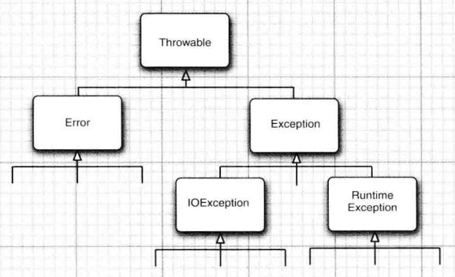

## Java中的异常机制

### java中异常的分类

在 Java 程序设计语言中，异常对象都是派生于 Throwable 类的一个实例 。

继承关系如下所示：



1. **Error 类**层次结构描述了 Java 运行时系统的内部错误和资源耗尽错误，这种情况不可控，也很少出现。

2. 在设计 Java 程序时 , 需要关注 **Exception** 层次结构 。 

   这个层次结构又分解为两个分支 :

   - **RuntimeException**：由程序错误导致的异常，如：
     - 错误的类型转换
     - 数组访问越界 
     - 访问 null 指针
   - **IOException**：而程序本身没有问题 , 但由于像 I/O 错误这类问题导致的异常属于其他异常，如：
     - 试图在文件尾部后面读取数据
     - 试图打开一个不存在的文件
     - 试图根据给定的字符串查找 Class 对象， 而这个字符串表示的类并不存在

3. **非受查 ( unchecked ) 异常**：

   ​		派生于 **RuntimeException **的异常，在方法的声明中没有声明，但在方法的**运行**过程中发生的各种异常被称为"不被检查的异常"。这种异常是错误，会被自动捕获。

   **受查 ( checked ) 异常**：

   ​		派生于 **IOException** 异常，在**编译**时**被强制检查的异常**称为"受检查的异常"。即在方法的声明中声明的异常。


### 抛出异常

抛出的异常都是**受查异常**

#### 声明异常

##### 语法

```java
public className(参数) throws FileNotFoundException, ...{}
```

1. 可以同时声明多个异常

2. 如果在**子类中覆盖了超类的一个方法**， 子类方法中声明的受查异常不能比超类方法中声明的异常更通用，即子类方法中声明的受查异常只能是超类方法中声明的受查异常中的几个。

3. 当声明的异常真的发生时，这个方法就会抛出了这样一个对应的异常对象，而不是返回这个方法应该返回的值，之后系统就会开始搜索异常处理器， 以便知道如何处理这个异常对象


##### 适用情况

1. 调用一个抛出受査异常的方法

2. 程序运行过程中发现错误， 并且利用 throw语句抛出一个受查异常

3. 程序出现错误

4. Java 虚拟机和运行时库出现的内部错误


#### 抛出异常

##### 语法

```java
public className(参数) throws FileNotFoundException, ...{
   throw new FileNotFoundException();
}
```

**步骤：**

1. 找到一个合适的异常类。

2. 创建这个类的一个对象。

3. 将对象抛出。

抛出异常后，程序会停止运行，throw之后的语句无法运行


#### 创建异常类

##### 语法

可能会遇到任何标准异常类都没有能够充分地描述清楚的问题。 在这种情况下就需要创建自己的异常类

定义的类应该包含**两个构造器**：

1. 默认的**无参构造器**，
2. 带有**详细描述信息**的构造器（**超类 Throwable** 的 toString 方法将会打印出这些详细信息）

例如：

```java
class FileFormatException extends IOException{
    public FileFormatExceptionO {}
    public FileFormatException(String gripe){
    	super(gripe);
    }
}
```

```java
public className() throws FileFormatException{
   throw new FileFormatException();
}
```


##### **超类 Throwable** 的方法

- **Throwable()**
  构造一个新的Throwable对象，这个对象没有详细的描述信息。
- **Throwable(String message)**
  构造一个新的throwable对象，这个对象带有特定的详细描述信息。习惯上，所有派生的异常类都支持一个默认的构造器和一个带有详细描述信息的构造器。
- **String  getMessage()**
  获得Throwable对象的详细描述信息。


### 捕获异常

#### 语法

```java
try {
	// code
	// more code
	// more code
} catch (ExceptionType e){
	// handler for this type
} finally {
    // 不管是否有异常被捕获，finally 子句中的代码都被执行
}
```


#### 捕获多个异常

对不同类型的异常做出**不同的处理**

```java
try{
	// code that might throw exceptions
}catch(FileNotFoundException e){
	// emergency action for missing files
}catch(UnknownHostException e){
	// emergency action for unknown hosts
}catch(IOException e){
	// emergency action for all other I/O problems
}
```

在**同一个 catch** 子句中可以捕获多个异常类型

```java
try{
	// code that might throw exceptions
}catch(FileNotFoundException | UnknownlostException e){
	// emergency action for missing files and unknown hosts
}
```


#### 捕获异常与传递异常

通常，**应该捕获**那些知道如何处理的异常，而将那些不知道怎样处理的异常继续**进行传递**。

如果想**传递一个异常**，就必须在方法的首部添加一个 throws 说明符，以便告知调用者这 个方法可能会抛出异常


