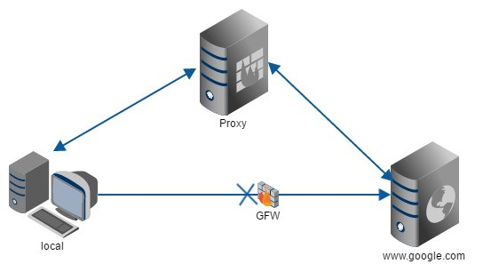

## Nginx简介

​		Nginx是一个高性能的**HTTP和反向代理服务器**，特点是占用内存小，并发能力强。Nginx可以作为**静态页面的 web服务器**，同时还**支持 CGI协议的动态语言**。

## 正向代理与反向代理

### 正向代理

​		国内的用户想要访问某一个网站时，会被阻挡。所以这个时候把请求发送到另外一个代理服务器（可以访问这个网站的服务器）上，由其代为转发请求和接收响应内容。隐藏了真实的请求客户端，服务端不知道真实的客户端是谁，客户端请求的服务都由代理服务器代替来请求。代理的是用户的请求。

### 反向代理

​		用户将请求发到某一个网站上时，这个网站的服务器并不会处理请求，而是将这个请求转发到其他的服务器，由这些服务器处理，隐藏了真实处理请求的服务器，这些服务器对外相当与一个服务器。利用反向代理可以采用多个服务器处理请求。代理的是服务器的请求。

### 负载均衡

​		当并发量较多时，单个服务器解决不了，可以通过增加服务器的数量，然后将请求分发到各个服务器上，这样将负载按照一定规则分发到不同的服务器，就是负载均衡。

### 动静分离

​		为了加快网站的解析速度，可以把动态页面和静态页面由不同的服务器来解析，加快解析速度。降低但个服务器的压力。

