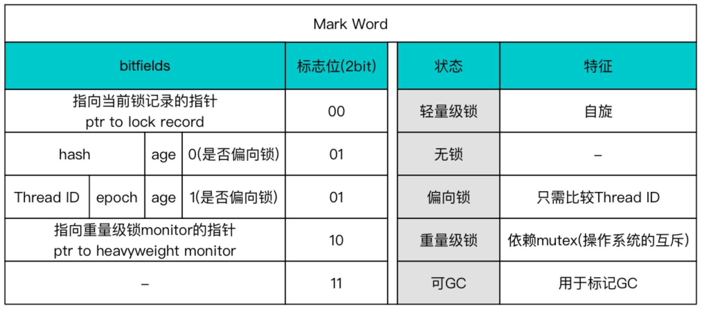
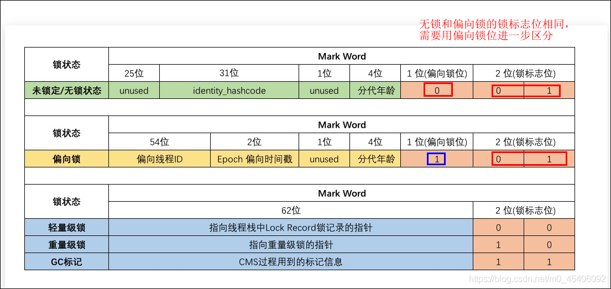

# Java对象的内存布局

### 1. 对象头（Header）

​		对象头中有两类数据。

#### 	对象运行时数据

​			第一类是用于**存储对象自身的运行时数据**，如**哈希码**（HashCode）、**GC分代年龄**、**锁状态标志**、**线程持有的锁**、**偏向线	程ID**、**偏向时间戳**等，这部分数据的长度在32位和64位的虚拟机（未开启压缩指针）中分别为32个比特和64个比特，官方称它	为**Mark Word**。Mark Word是一个**动态定义的**数据结构，尽可能多的储存了更多的信息。

​			Mark Word的格式：

​																							**32位**的Mark Word

​																							**64位**的Mark Word

#### 	类型指针

​			类型指针，即对象指向它的类型元数据的指针，Java虚拟机通过这个**指针来确定该对象是哪个类的实例**。并不是所有的虚拟     	机实现都必须在对象数据上保留类型指针，换句话说，查找对象的元数据信息并不一定要经过对象本身。

​			如果对象是一个Java数组，那在对象头中还必须有一块用于**记录数组长度的数据**。因为在分配内存时必须要知道大小，所以	必须记录。

### 2. 实例数据（Instance Data）

​		实例数据部分是对象真正存储的有效信息，即我们在程序代码里面所定义的各种类型的字段内容，无论是从父类继承下来的，还是在子类中定义的字段都必须记录起来。

​		HotSpot虚拟机默认的分配顺序为longs/doubles、ints、shorts/chars、bytes/booleans、oops（Ordinary Object Pointers，OOPs），从以上默认的分配策略中可以看到，**相同宽度的字段总是被分配到一起存**放，在满足这个前提条件的情况下，在**父类中定义的变量会出现在子类之前**。

### 3. 对齐填充（Padding）

​		对齐填充仅仅起着占位符的作用。由于HotSpot虚拟机的自动内存管理系统要求**对象起始地址必须是8字节的整数倍**，换句话说就是任何对象的大小都必须是8字节的整数倍。对象头部分已经被精心设计成正好是8字节的倍数（1倍或者2倍），因此，**如果对象实例数据部分没有对齐的话，就需要通过对齐填充来补全**。

