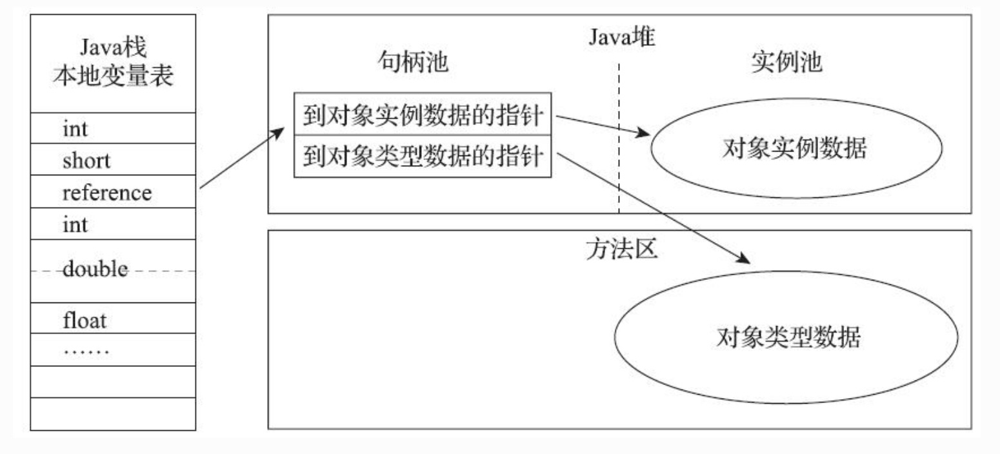
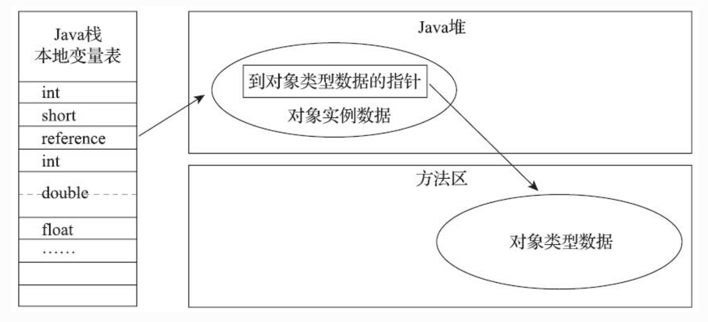

# Java对象的访问定位

### 通过句柄访问

​		若采用此种方式**Java堆中**，会划分出一块内存作为**句柄池**，**引用（refenrence）就是句柄的地址**，此地址包括**实例对象的地址和类型数据的地址**。

​		reference中存储的是稳定句柄地址，在对象被移动（垃圾收集时移动对象是非常普遍的行为）时只会改变句柄中的实例数据指针，而reference本身不需要被修改。

### 通过指针访问

​		一个引用（refenrence）包括了**对象类型数据指针**和**对象实例数据**

​		直接指针来访问最大的好处就是**速度更快**，它节省了一次指针定位的时间开销，由于对象访问在Java中非常频繁，因此这类开销积少成多也是一项极为可观的执行成本。**HotSpot**使用的是此种方法。

