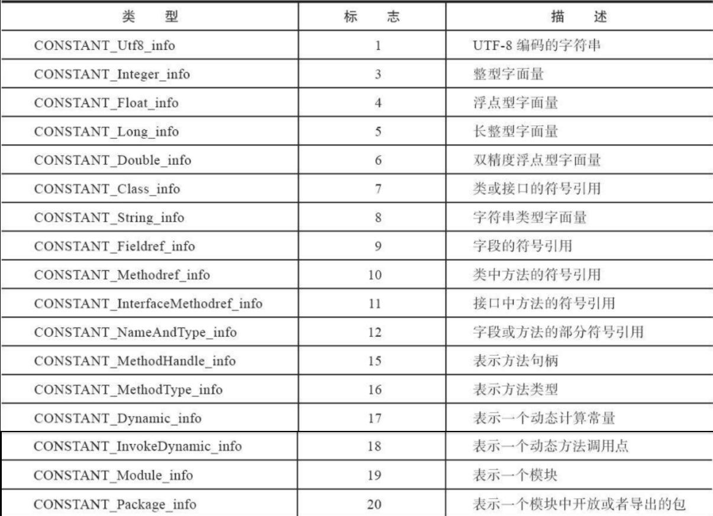
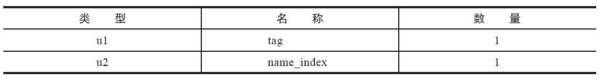
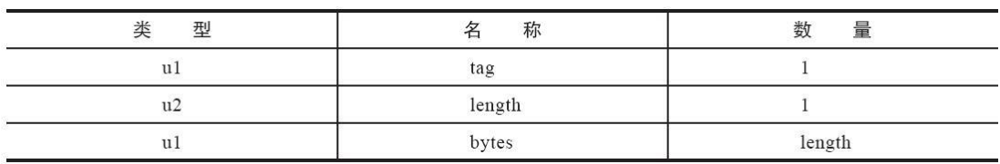
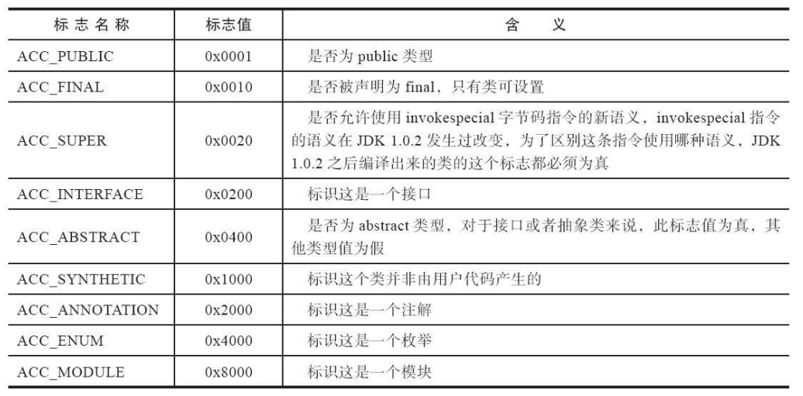
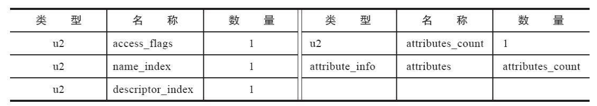
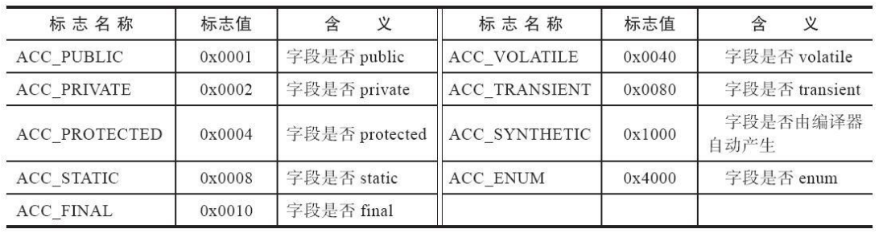
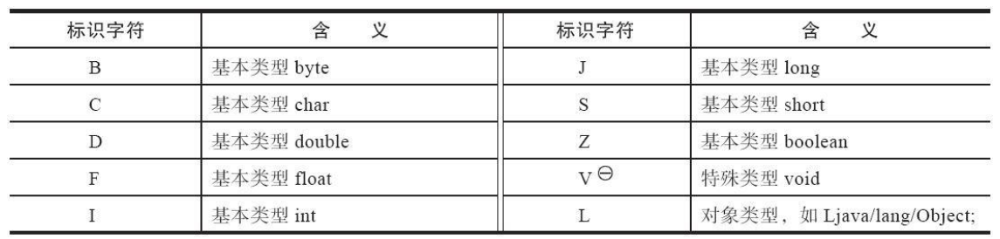
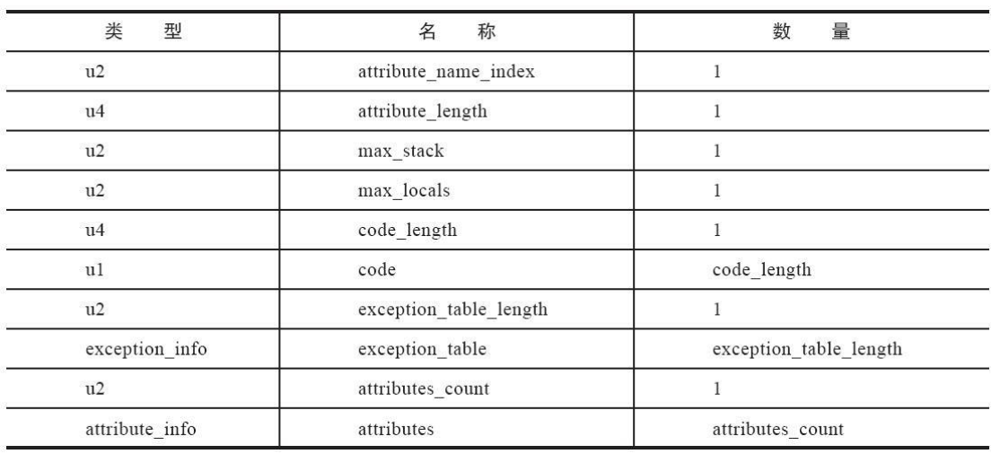
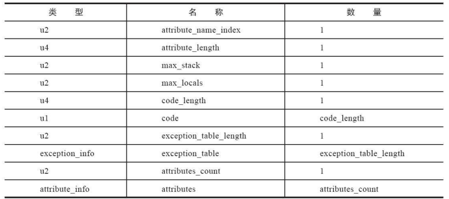

## 数据类型

​		Class文件中只有两种数据结构：

1. **无符号数**：以 u1、 u2、 u4、 u8 来分别代表 1 个字节、 2 个字节、 4 个字节和 8 个字节的无符号数，无符号数可以用来描述数字、索引引用、数量值或者按照 UTF-8 编码构成字符串值。
2. **表**：由多个无符号数或者其他表作为数据项构成的复合数据类型，为了便于区分，所有表的命名都习惯性地以“_info”结尾。表用于描述有层次关系的复合结构的数据，整个 Class 文件本质上也可以视作是一张表，

​	

## Class文件结构

### 1. 魔数

​		每个 Class文件的头**四个字节被称为魔数**，具体的值为 0xCAFEBABE，唯一作用是确定这个文件是一个能被虚拟机接受的 Class文件。

### 2. 版本号

​		然后四个字节是版本号，前两个字节是次版本号，后两个字节是主版本号。

### 3. 常量池

​		之后是常量池， 常量池的最前面要放置一项 u2类型的数据，代表常量池容量计数器，容量计数是从 1开始计数。

​		常量池中**每一个常量都是一个表**，**索引从 1开始计数**。0索引空出来是为了让以后某些不需要常量的数据来占位。

#### 常量类型

1. **字面量**：字面量比较接近于 Java 语言层面的常量概念，如文本字符串、被声明为 final 的常量值等
2. **符号引用**：符号引用属于编译原理方面的概念，包括：
   - 被模块导出或者开放的包
   - 类和接口的全限定名
   - 字段的名称和描述符
   - 方法的名称和描述符
   - 方法句柄和方法类型
   - 动态调用点和动态常量

#### 表结构

​		截止至 JDK13，共有 17种表结构，如下所示：

​		表结构中，起始的第一位都是个 u1类型的标志位，代表属于哪种类型的表结构。

​		以 CONSTANT_Class_info 为例，其结构为：

​		tag就是标志位，name_index是常量池中某一个常量的索引，这个常量就储存了类名，一般会指向 CONSTANT_Utf8_info类型的表，CONSTANT_Utf8_info 的结构为：

​                           

​		tag是标志位，length 值说明了这个 UTF-8 编码的字符串长度是多少字节，它后面紧跟着的长度为 length 字节的连续数据是一个使用 UTF-8 缩略编码表示的字符串。

​		Class 文件中方法、字段等都需要引用 **CONSTANT_Utf8_info 型**常量来描述名称，所以 CONSTANT_Utf8_info 型常量的最大长度也就是 Java 中**方法、字段名的最大长度**。而这里的最大长度**就是 length 的最大值**，既 u2 类型能表达的最大值 65535。所以 Java 程序中如果定义了超过 64KB 英文字符的变量或方法名，即使规则和全部字符都是合法的，也会无法编译。

### 4. 访问标志

​		访问标志（access_flags）大小为 2 个字节，用于识别类或者接口层次的访问信息，比如是否是 public或者是否被声明为 final。

access_flags 中一共有 16 个标志位可以使用，当前只定义了其中 9 个。

### 5. 类索引、父类索引与接口索引集合

​		类索引、父类索引和接口索引集合都按顺序排列在访问标志之后。

- **类索引**：

  ​		u2 类型，占用两个字节，用于确定一个类的全限定名。指向一个类型为CONSTANT_Class_info 的类描述符常量，通过 CONSTANT_Class_info 类型的常量中的索引值可以找到定义在 CONSTANT_Utf8_info 类型的常量中的全限定名字符串。

- **父类索引**：

  ​		u2 类型，占用两个字节，用于确定一个类的父类的全限定名。也指向一个类型为CONSTANT_Class_info 的类描述符常量。除了 java.lang.Object 之外，所有的 Java类都有父类，因此除了 java.lang.Object 外，所有 Java 类的父类索引都不为 0。

- **接口索引集合**： 

  ​		u2 类型的数据的集合。接口索引集合用来描述一个类实现了哪些接口，这些被实现的接口将按 implements 关键字后的接口顺序从左到右排列在接口索引集合中。接口索引集合的第一项 u2 类型的数据为接口计数器（interfaces_count），表示索引表的容量。

### 6. 字段表集合

​		字段表（field_info）用于描述接口或者类中声明的变量。 Java 语言中的“字段”（Field）包括**类级变量**以及**实例级变量**， 但不包括在方法内部声明的局部变量。在 Class文件的字段表集合部分的第一个 u2 类型的数据为容量计数器 fields_count，表明有几个字段表。

​		字段表的结构如下图：

​		字段修饰符放在 access_flags中，其结构为：

​		access_flags之后的  **name_index** 为字段的**简单名**，**descriptor_index**为字段和方法的**描述符**。**attribute_info**为**属性表集合**，用于存储一些额外的信息，字段表可以在属性表中附加描述零至多项的额外信息。

#### 全限定名

​		将类名中的 “ . ”  换成 “ / ”，然后在结尾加上 “ ; ” 就是一个类的全限定名，如 com.exp.test —> com/exp/test;。

#### 简单名

​		简单名就是指没有类型和参数修饰的方法或者字段名称。

#### 描述符

​		描述符用来**描述字段的数据类型、方法的参数列表**（包括数量、类型以及顺序）和返回值。

​		根据描述符规则，**基本数据类型**（byte、 char、double、 float、 int、 long、 short、 boolean）以及代表无返回值的 void 类型都用一个**大写字符**来表示，而对象类型则用**字符 L 加对象的全限定名**来表示。

​		对于数组类型，每一维度将使用一个前置的“[”字符来描述，如一个定义为 “java.lang.String[][]” 类型的二维数组将被记录成
“[[Ljava/lang/String; ”，一个整型数组“int[]”将被记录成“[I”。

### 7. 方法表集合

​		用于描述一个方法，Class 文件存储格式中对方法的描述与对字段的描述采用了几乎完全一致的方式，方法表的结构如同字段表一样，依次包括访问标志（access_flags）、名称索引（name_index）、描述符索引（descriptor_index）、属性表集合（attribute_info）几项。

### 8. 属性表集合

​		属性表存在于字段表和方法表中，属性表的结构如下表：

​		属性表中比较重要的属性：

- **Code属性**：

  ​		Java 程序方法体里面的代码经过 Javac 编译器处理之后，最终变为字节码指令存储在 Code 属性内。

- **Exceptions 属性**：

  ​		作用是列举出方法中可能抛出的受查异常（Checked Excepitons），也就是方法描述时在 throws 关键字后面列举的异常。

- **ConstantValue 属性**：

  ​		ConstantValue 属性的作用是通知虚拟机自动为静态变量赋值。只有被 static 关键字修饰的变量（类变量）才可以使用这项属性。

- **InnerClasses 属性**：

  ​		用于记录内部类与宿主类之间的关联

- **Deprecated属性**：

  ​		标志类型的布尔属性，表示某个类、字段或者方法，已经被程序作者定为不再推荐使用。

#### Code 属性

​		Java 程序方法体里面的代码经过 Javac 编译器处理之后，最终变为字节码指令存储在 Code 属性内。

​		Code 属性出现在方法表的属性集合之中，但并非所有的方法表都必须存在这个属性，譬如接口或者抽象类中的方法就不存在 Code 属性。

​		Code 属性的结构如下：

​	        

- **attribute_name_index**：

  ​		是一个指向 CONSTANT_Utf8_info 型常量的索引，此常量值固定为“Code”，它代表了该属性的属性名称。

- **attribute_length**：

  ​		指示了属性值的长度，由于属性名称索引与属性长度一共为 6 个字节，所以属性值的长度固定为整个属性表长度减
  去 6 个字节。

- **max_stack**：

  ​		代表了**操作数栈（Operand Stack）深度的最大值**。在方法执行的任意时刻，操作数栈都不会超过这个深度。虚拟机运行的时候需要根据这个值来分配栈帧（Stack Frame）中的操作栈深度。

- **max_locals**：

  ​		代表了局部变量表所需的存储空间，max_locals 的单位是变量槽（Slot），变量槽是虚拟机为局部变量分配内存所使用的最小单位。如果一个方法不是 static方法，则会有一个局部变量来实现 this关键字的功能，代表此方法所属的对象的引用，在虚拟机调用此方法时通过参数传入。所以**非静态的方法中，参数列表最少有一个参数，最少有一个局部变量**（即一个变量槽）。
  
- **code_length**：

  ​		代表字节码长度。

- **code**：

  ​		code 用于存储字节码指令的一系列字节流。每个指令就是一个 u1 类型的单字节。
  
- **exception_table**:

  显式异常处理表（异常表）集合，异常表对于 Code 属性来说并不是必须存在的。

