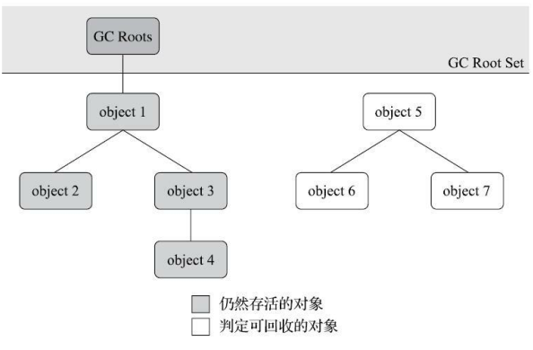

## 判断对象是否需要回收

​		**程序计数器**、**虚拟机栈**、**本地方法栈** 3 个区域与线程的生命周期相同，**线程结束就会被回收**。而且在**栈**中，方法开始运行时入栈，方法结束时出栈，**出栈就是内存的回收**

​		而 **Java 堆**和**方法区**这两个区域则有着很显著的不确定性，垃圾收集器所关注的正是这部分内存该如何管理。

#### 引用计数算法

​		在对象中添加一个引用计数器，每当有一个地方**引用**此对象时，计数器值就**加一**；当**引用失效**时，计数器值就**减一**；任何时刻**计数器为零**的对象就是不可能再被使用，就需要**被回收**。

​		此算法存在较多缺陷，比如两个对象之间相互引用，又不被其他对象引用，实际上这两个对象已经不可能再被访问，但这两个对象却不会被回收。

#### 可达性分析算法

​		基本思路就是通过一系列称为“GC Roots”的根对象作为起始节点集，从这些节点开始，根据**引用关系向下搜索**，搜索过程所走过的路径称为“**引用链**”（Reference Chain），如果某个对象到 GC Roots 间没有任何引用链相连，或者用图论的话来说就是
从 GC Roots 到这个**对象不可达**时，则证明**此对象是不可能再被使用的**。

