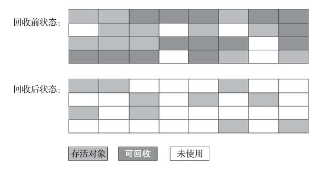
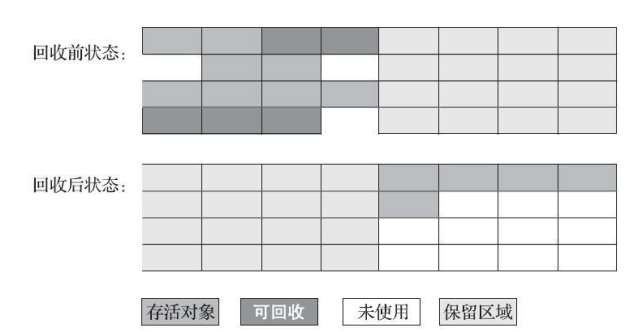
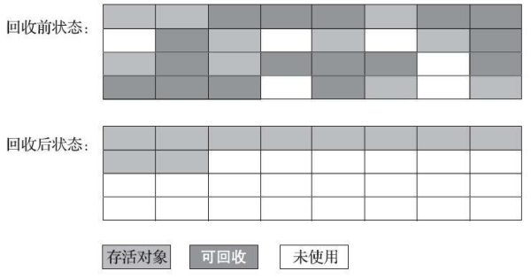
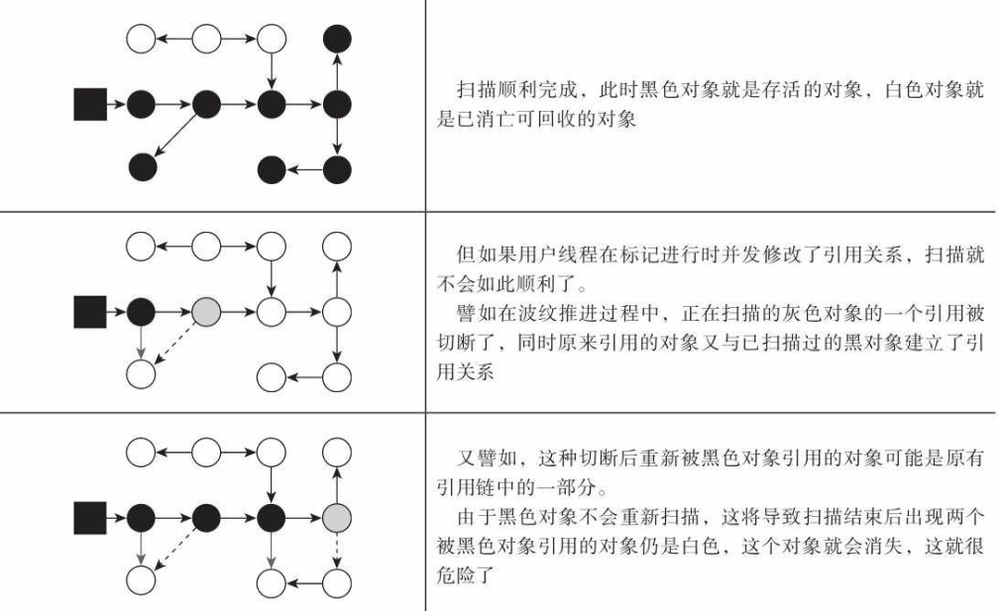

# 垃圾收集算法

​		从如何判定对象消亡的角度出发，垃圾收集算法可以划分为“引用计数式垃圾收集”
（Reference Counting GC）和“**追踪式垃圾收集**”（Tracing GC）两大类，这两类也常被
称作“**直接垃圾收集**”和“**间接垃圾收集**”。

​		较为常用的是追踪式垃圾收集，分代收集就是追踪式垃圾收集。

## 分代收集理论

​		一般至少会把 **Java 堆**划分为**新生代**（Young Generation）和**老年代**（Old Generation）两个区域。顾名思义，在新生代中，**每次垃圾收集时都发现有大批对象死去**，而**每次回收后存活的少量对象，将会逐步晋升到老年代中存放**。

### 三个假说

- ==弱分代假说==：

  绝大多数对象都是朝生夕灭的。

- ==强分代假说==：

  熬过越多次垃圾收集过程的对象就越难以消亡。

- ==跨代引用假说==：

  跨代引用相对于同代引用来说仅占极少数。

​		前两个分代假说共同奠定了多款常用的垃圾收集器的一致的设计原则：收集器应该将 **Java 堆划分出不同的区域**，然后**将回收对象依据其年龄**（年龄即对象熬过垃圾收集过程的次数）**分配到不同的区域之中存储**。

​		第三个假说考虑到了新生代中的对象是完全有可能被老年代所引用的。

### 标记-清除算法

​		首先**标记出所有需要回收的对象**，在标记完成后，**统一回收掉所有被标记的对象**，也可以反过来，标记存活的对象，统一回收所有未被标记的对象



​		缺陷：

1. **执行效率不稳定**，如果 Java 堆中包含大量对象，而且其中大部分是需要被回收的，这时必须进行大量标记和清除的动作，导致**标记和清除两个过程的执行效率都随对象数量增长而降低**。

2. **内存空间的碎片化问题**，标记、清除之后会产生大量不连续的内存碎片，空间碎片太多可能会导致当以后在程序运行过程中需要分配较大对象时无法找到足够的连续内存而不得不提前触发另一次垃圾收集动作


### 标记-复制算法

​		将可用<u>内存按容量划分为大小相等的两块，每次只使用其中的一块</u>。当这一块的内存用完了，就<u>将还存活着的对象复制到另外一块上面，然后再把已使用过的内存空间一次清理掉</u>。



​		只适用于**多数对象都是可回收的情况**，如果内存中**多数对象都是存活的**，这种算法将会产生大量的内存间**复制的开销**。每次都是针对整个半区进行内存回收，在复制时只要移动堆顶指针，按顺序分配即可，解决了内存空间的碎片化问题的问题。

​		一种更优化的半区复制分代策略，现在称为“**Appel 式回收**”。 Appel 式回收的具体做法是把新生代分为<u>一块较大的 Eden 空间和两块较小的 Survivor 空间</u>，每次分配内存只使用Eden 和其中一块 Survivor。发生垃圾搜集时，<u>将 Eden 和 Survivor 中仍然存活的对象一次性复制到另外一块 Survivor 空间上，然后直接清理掉 Eden 和已用过的那块 Survivor空间</u>。 如果另外一块 Survivor 空间没有足够空间存放上一次新生代收集下来的存活对象，<u>这些对象便将通过分配担保机制直接进入老年代</u>。


### 标记-整理算法

​		标记过程仍然与“标记-清除”算法一样，但不需要将内存分为两部分，且后续步骤不是直接对可回收对象进行清理，而是**让所有存活的对象都向内存空间一端移动**，然后直接清理掉边界以外的内存。



​		适用于老年代，大多数对象都不可回收的情况。在这种情况下比标记-复制算法快，而且不用浪费一半的内存。但由于要移动对象，改变了对象的地址，所以**必须全程暂停用户应用程序才能进行**。


## HotSpot虚拟机垃圾回收实现细节

### 根节点枚举

​		固定可作为 GC Roots 的节点主要在**全局性的引用**（例如常量或类静态属性）与**执行上下文**（例如栈帧中的本地变量表）中。

​		固定**可作为 GC Roots 的对象**包括以下几种：

- 在虚拟机栈（栈帧中的本地变量表）中引用的对象	
- 在方法区中类静态属性引用的对象
- 在方法区中常量引用的对象
- 在本地方法栈中 JNI（即通常所说的 Native 方法）引用的对象
- Java 虚拟机内部的引用
- 所有被同步锁（ synchronized 关键字）持有的对象
- 反映 Java 虚拟机内部情况的 JMXBean、 JVMTI 中注册的回调、本地代码缓存等
- 还可以有其他对象“临时性”地加入

​		迄今为止，可达性分析算法耗时最长的**查找引用链**的过程已经可以做到与用户线程一起并发，所有收集器在**根节点枚举**这一步骤时都是**必须暂停用户线程**的。这是因为根节点枚举始终还是必须在一个能保障**一致性的快照**中才得以进行，这里“一致性”的意思是不会出现分析过程中，根节点集合的对象引用关系还在不断变化，否则，分析结果的准确性就无法保证。

​		目前主流 Java 虚拟机使用的都是**准确式垃圾收集**（虚拟机可以知道内存中某个位置的数据具体是什么类型）。HotSpot 的解决方案里，是使用一组称为 **OopMap（Ordinary Object Pointer Map）**的数据结构来达到这个目的，OopMap在**特定指令行数**的记录了对象的所在地址的信息（每个记录的位置有 OopMap，以 Map 的结构记录了对象的信息）。

​		一旦类加载动作完成的时候， HotSpot 就会把对象内什么偏移量上是什么类型的数据计算出来，再加上即时编译也会在**特定的位置**记录下栈里和寄存器里哪些位置是引用，这样就可以把**对象引用的指针**的位置存入 OopMap 并标记出来，所以并不需要真正一个不漏地从方法区等 GC Roots 开始查找，加速了查找过程。

​		但是，根据前两条假说逻辑推理得出的隐含推论：<u>存在互相引用关系的两个对象，是应该倾向于同时生存或者同时消亡的</u>。所以有可能会出现下面一种情况。

​		<u>一个老年代的对象引用了一个新生代的对象，由于老年代不容易被回收，则被引用的新生代也不会被轻易回收，会被放到老年代</u>。在这种情况中，虽然 GC roots 原本的定义中并不包含老年代，但又为了确保可达性分析结果的正确性，有**扫描整个老年代**的必要，这会加大根节点枚举时间。

​		根据第三条假说，跨代引用是极少数的，所以不应该为了少数的有新生代引用的老年代对象而去扫描整个老年代。**记忆集**的就是为了解决这个问题而出现的。首先将老年代划分为多个区域，然后在新生代创建记忆集。记忆集用于保存老年代各个区域有没有跨代引用的信息。然后只需将有跨代引用的老年代区域扫描即可，不需要扫描所有老年代。


### 安全点

​		安全点的作用是解决了什么时候进行垃圾回收和**垃圾回收频率**的问题。安全点的位置与 OopMap（申请对象的位置） 中标记的位置相同。

​		有了安全点的设定，也就决定了用户程序执行时并非在代码指令流的任意位置都能够停顿下来开始垃圾收集，而是<u>强制要求必须执行到达安全点后才能够暂停</u>。

​		如何在垃圾收集发生时让所有线程（这里其实不包括执行 JNI 调用的线程）都跑到最近的安全点，然后停顿下来。解决这个问题主要有两个方案。

1. **抢先式中断**不需要线程的执行代码主动去配合，在垃圾收集发生时，系统
   首先把所有用户线程全部中断，如果发现有用户线程中断的地方不在安全点上，就恢复
   这条线程执行，让它一会再重新中断，直到跑到安全点上。
2. **主动式中断**是简单地设置一个标志位，<u>各个线程执行过程时每经过一个安全点，就会主动去检查这个中断标志</u>，一旦发现中断标志为真，就自己在最近的安全点上主动中断挂起。检查中断标志的位置不只包括安全点，另外还要加上<u>所有创建对象和其他需要在 Java 堆上分配内存的地方</u>，这是为了检查是否要进行垃圾收集，避免没有足够内存分配新对象。


### 安全区域

​		当发生线程暂停运行或阻塞时，此时若中断标志为真，就会出现所有的线程都在等待某个被阻塞的线程的情况，安全区域就是为了解决这个问题。安全区域是指能够确保在某一段代码片段之中，引用关系不会发生变化，因此，<u>在这个区域中任意地方开始垃圾收集都是安全的。我们也可以把安全区域看作被扩展拉伸了的安全点</u>。

​		当用户线程执行到安全区域里面的代码时，首先会标识自己已经进入了安全区域，那样当这段时间里虚拟机要发起垃圾收集时就不必去管这些已声明自己在安全区域内的线程了。当线程要离开安全区域时，它要检查虚拟机是否已经完成了根节点枚举（或者垃圾收集过程中其他需要暂停用户线程的阶段），此时可能还在根节点枚举的准备阶段（等待其他线程进入安全区域），若不检查，可能就运行出了安全区，那么就还得寻找另外一个安全点，浪费了时间。如果根节点枚举完成了，那线程就当作没事发生过，继续执行；否则它就必须一直等待，直到收到可以离开安全区域的信号为止。


### 记忆集与卡表

​		记忆集是一种用于记录从**非收集区域**指向**收集区域**的指针集合的抽象数据结构。记忆集需要存放 **某一块非收集区域是否存在有指向收集区域的指针** 的信息。

​		记忆集中每一条记录都代表非收集区域的一部分，收集区域的划分有大致三个级别：

- 字长精度： 每个记录精确到一个机器字长，即总线宽度，该字包含跨代指针。
- 对象精度： 每个记录精确到一个对象，该对象里有字段含有跨代指针。
- 卡精度： 每个记录精确到一块内存区域，该区域内有对象含有跨代指针。

​		“**卡精度**”所指的是用一种称为“卡表”（Card Table）的方式去实现记忆集。

​		卡表最简单的形式可以只是一个**字节数组**，而 HotSpot 虚拟机确实也是这样做的。以下这行代码是 **HotSpot 默认的卡表标记逻辑**：

```c
CARD_TABLE [this address >> n] = 0;
```

​		字节数组 CARD_TABLE 的每一个元素都对应着其标识的内存区域中一块特定大小的内存块，这个内存块被称作“**卡页**”（Card Page），一般来说，卡页大小都是以 $2^n$ 的字节数。一个地址所在的**卡页索引**用 **this address >> n** 来计算，即向右移动 n 位，除上 $2^n$，因为每一个卡页的大小是 $2^n$。

​		一个卡页的内存中通常包含不止一个对象，只要<u>卡页内有一个（或更多）对象的字段存在着跨代指针，那就将对应卡表的数组元素的值标识为 1</u><u>，称为这个元素变脏（Dirty）</u>，没有则标识为 0。在垃圾收集发生时，只要筛选出卡表中变脏的元素，就能轻易得出哪些卡页内存块中包含跨代指针，把它们加入 GC Roots 中一并扫描。


### 写屏障

​		写屏障（Write Barrier）是为了解决什么时候使记忆集中某一部分变脏，以及如何变脏。在 HotSpot 虚拟机里是通过写屏障术维护卡表状态的。

​		写屏障可以看作在虚拟机层面<u>对“引用类型字段赋值”这个动作的 AOP 切面，在引用对象赋值时会产生一个环形通知（Around Advice）</u>，供程序执行额外的动作，也就是说赋值的前后都在写屏障的覆盖范畴内。在赋值前的部分的写屏障叫作写前屏障（Pre-Write Barrier），在赋值后的则叫作写后屏障（Post-Write Barrier）。 HotSpot 虚拟机的许多收集器中都有使用到写屏障，但直至 G1 收集器出现之前，其他收集器都只用到了写后屏障。

​	卡表还存在一个**伪共享**的问题，即在高并发的情况下，会出现多个线程同时修改相同的卡表中的卡页的情况。解决方案是不采用无条件的写屏障，而是先检查卡表标记，<u>只有当该卡表元素未被标记过时才将其标记为变脏</u>。


### 并发的可达性分析

​		可达性分析时并不需要暂停所有的用户线程，而是可以与用户线程并发。但在用户线程修改对象之间的引用关系时，就有可能会出现以下两种错误：

- 是把原本消亡的对象错误标记为存活
- 把原本存活的对象错误标记为已消亡，此种情况如下图所示。



​				白色： 表示对象尚未被垃圾收集器访问过。

​				黑色： 表示对象已经被垃圾收集器访问过，不会再次被扫描。

​				灰色： 表示对象已经被垃圾收集器访问过，但这个对象上至少存在一个引用还没有被扫							  描过。

​		当且仅当以下**两个条件**同时满足时，会产生“对象消失”的问题，即第二种错误：

- 赋值器**插入**了一条或多条**从黑色**对象**到白色**对象的新引用
- 赋值器**删除**了全部**从灰色**对象**到该白色**对象的直接或间接引用

​		所以就有两个解决方案：

- **增量更新**：

  当黑色对象插入新的指向白色对象的引用关系时，就<u>将这个新插入的引用记录下来</u>，等并发扫描结束之后，再将这些<u>记录过的引用关系中的黑色对象为根，重新扫描一次</u>。

- **原始快照**:

  当灰色对象要删除指向白色对象的引用关系时，就<u>将这个要删除的引用记录下来</u>，在并发扫描结束之后，<u>再将这些记录过的引用关系中的灰色对象为根</u>，相当于将删除的引用加上（并没有），<u>重新扫描一次</u>。

