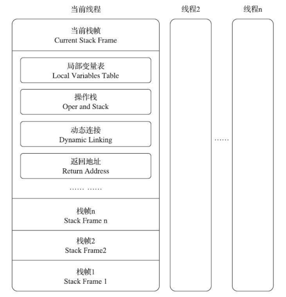

# 运行时栈帧结构

​		Java 虚拟机以方法作为最基本的执行单元， <u>栈帧（Stack Frame）用于支持虚拟机进行方法调用和方法执行背后的数据结构</u>，它也是虚拟机运行时数据区中的<u>虚拟机栈（Virtual Machine Stack）的栈元素</u>。线程每调用一个方法就对应着虚拟机栈栈帧的入栈，方法执行完毕或者异常终止对应着出栈（销毁）。栈帧存储了方法的<u>局部变量表、操作数栈、动态连接和方法返回地址</u>等信息。

​		以 Java 程序的角度来看，同一时刻、同一条线程里面，在调用堆栈的所有方法都同时处于执行状态。而对于执行引擎来讲，在活动线程中，只有位于栈顶的方法才是在运行的，只有位于栈顶的栈帧才是生效的，其被称为**当前栈帧**（Current Stack Frame），与这个栈帧所关联的方法被称为**当前方法**。

​		栈帧的概念结构：

## 局部变量表

​		局部变量表（Local Variables Table）是一组变量值的存储空间，用于<u>存放方法参数和方法内部定义的局部变量</u>。

​		局部变量表的容量以**变量槽（ Variable Slot）**为最小单位。<u>一个变量槽可以存放一个 32 位以内的数据类型</u>， Java 中占用不超过 32 位存储空间的数据类型有 boolean、 byte、 char、 short、 int、 float、 reference和 returnAddress 这 8 种类型。<u>对于 64 位的数据类型， Java 虚拟机会以高位对齐的方式为其分配两个连续的变量槽空间</u>。 

​		<u>通过索引定位的方式使用局部变量表，索引值的范围是从 0 开始至局部变量表最大的变量槽数量</u>。如果访问的是 32 位数据类型的变量，索引 N 就代表了使用第 N 个变量槽，如果访问的是 64 位数据类型的变量，则说明会同时使用第 N 和 N+1 两个变量槽。

​		如果执行的是<u>实例方法（没有被 static 修饰的方法），那局部变量表中第 0 位索引的变量槽默认是用于传递方法**所属对象实例的引用**，在方法中可以通过关键字“this”来访问到这个隐含的参数</u>。其余参数则按照参数表顺序排列，占用从 1 开始的局部变量槽，**参数表**分配完毕后，再根据方法体**内部定义的变量**顺序和作用域分配其余的变量槽。

​		局部变量表中的变量槽是可以重用的，方法体中定义的变量，其作用域并不一定会覆盖整个方法体，如果当前字节码 PC 计数器的值已经超出了某个变量的作用域，那这个变量对应的变量槽就可以交给其他变量来重用。如果程序已经运行到了某个变量的作用域之外，此变量所占用的内存（变量槽）可以存放其他变量。但若此时没有新的变量声明，则此变量依旧会占用此内存，垃圾回收器也不会回收这个变量的内存。

## 操作数栈

​		java字节码的指令并不想汇编指令一样，操作数紧跟在指令代码的后面，而是只有指令没有操作数。java字节码的操作数都放在操作数栈中，在字节码运行时，操作数栈配合着进行出栈和入栈的操作，从而实现对操作数的操作。比如字节码指令 iadd，此指令在运行的时候会对操作数栈中两个 int 型的数值（栈顶和栈顶的下一个元素）进行分别的出栈然后相加，然后将相加的结果重新入栈。

​		操作数栈是一个后入先出（ Last In First Out， LIFO）栈。同局部变量表一样，**操作数栈的最大深度**也在编译的时候被写入到 **Code 属性的 max_stacks 数据项**之中。操作数栈的每一个元素都可以是包括 long 和double 在内的任意 Java 数据类型。

​		在概念模型中，两个不同栈帧作为不同方法的虚拟机栈的元素，是完全相互独立的。但是在<u>大多虚拟机的实现里都会进行一些优化处理，令两个栈帧出现一部分重叠</u>。让下面栈帧的部分操作数栈与上面栈帧的部分局部变量表重叠在一起，这样做不仅
节约了一些空间，更重要的是在进行方法调用时就可以直接共用一部分数据，无须进行额外的参数复制传递

## 动态连接

​		  每个栈帧都包含一个指向**运行时常量池**（用于存放编译期生成的**各种字面量**与**符号引用**）中该栈帧所属方法的引用，持有这个引用是为了支持方法调用过程中的动态连接（Dynamic Linking）。一部分的方法将在每一次运行期间都转化为直接引用，这个指向运行时常量池中方法名的引用就用于辅助相关字节码找到此方法的直接引用。

## 方法返回地址

​		当一个方法开始执行后，只有两种方式退出这个方法。

​		第一种方式是执行引擎<u>遇到任意一个方法返回的字节码指令，这时候可能会有返回值传递给上层的方法调用者</u>（调用当前方法的方法称为调用者或者主调方法），方法是否有返回值以及返回值的类型将根据遇到何种方法返回指令来决定，这种退出方法的方式称为**正常调用完成**（NormalMethod Invocation Completion）。在返回被调用位置时，主调方法的 PC 计数器的值就可以作为返回地址，栈帧中很可能会保存这个计数器值。

​		第二种退出方式是在<u>方法执行的过程中遇到了异常，并且这个异常没有在方法体内得到妥善处理</u>。无论是 Java 虚拟机内部产生的异常，还是代码中使用 athrow 字节码指令产生的异常，只要在本方法的异常表中没有搜索到匹配的异常处理器，就会导致方法退出，这种退出方法的方式称为**异常调用完成**（Abrupt Method Invocation Completion） 。在返回被调用位置时，返回地
址是要通过异常处理器表来确定的，栈帧中就一般不会保存这部分信息。

​		方法退出的过程实际上等同于把当前栈帧出栈，因此退出时**可能执行**的操作有：恢复上层方法的局部变量表和操作数栈，把返回值（如果有的话）压入调用者栈帧的操作数栈中，调整 PC 计数器的值以指向方法调用指令后面的一条指令等。

## 附加信息

​		《Java 虚拟机规范》允许虚拟机实现增加一些规范里没有描述的信息到栈帧之中，例如与调试、性能收集相关的信息等。

