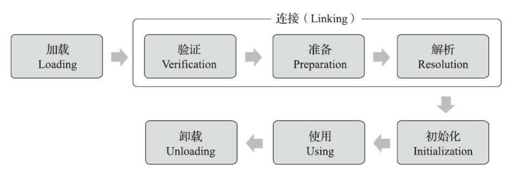

# 虚拟机的类加载机制

​		Java 虚拟机把描述类的数据从 Class 文件加载到内存，并对数据进行校验、转换解析和初始化，最终形成可以被虚拟机直接使用的 Java 类型，这个过程被称作虚拟机的类加载机制。


## 类加载的过程



​		加载、验证、准备、初始化和卸载这五个阶段的顺序是确定的，类型的加载过程必须按照这种顺序按部就班地开始，而解析阶段在某些情况下可以在初始化阶段之后再开始。

​		<u>这些阶段不是必须在上一阶段执行完成后才能执行下一阶段，这只是不同阶段开始的顺序，这些阶段通常都是互相交叉地混合进行的，会在一个阶段执行的过程中调用、激活另一个阶段</u>。


### 加载

​		在加载阶段， Java 虚拟机需要完成以下三件事情：

1. 通过一个类的全限定名来获取定义此类的二进制字节流。
   - 这些**字节流并不是必须在 Class文件中获取**，也可以从网络等途径获取，或者通过计算动态的生成。
   - 若此类不是一个数组类，则此阶段可以使用 Java虚拟机内置的引导类加载器完成，也可以用**用户自定义的类加载器**完成。
   - 若此类是一个数组类，则并不会通过类加载器创建，是由 Java虚拟机直接在内存中动态构造出来的。
2. 将这个字节流所代表的静解析态存储结构转化为方法区的运行时数据结构。
3. 在内存中生成一个代表这个类的 java.lang.Class 对象，作为**方法区**这个类的各种数据的访问入口。


​		加载阶段与连接阶段的部分动作（如一部分字节码文件格式验证动作）是交叉进行的，加载阶段尚未完成，连接阶段可能已经开始，但这些夹在加载阶段之中进行的动作，仍然属于连接阶段的一部分，这两个阶段的开始时间仍然保持着固定的先后顺序。


### 连接

#### 验证

​		验证是连接阶段的第一步，这一阶段的目的是确保 Class 文件的字节流中包含的信息符合《Java 虚拟机规范》的全部约束要求，保证这些信息被当作代码运行后不会危害虚拟机自身的安全。

​		一些比较危险的操作，比如数组越界，跳转到不存在的代码行等操作 Java语言可以抛出异常并拒绝编译，但 Class 文件并不一定只能由 Java 源码编译而来，它可以使用包括靠键盘 0 和 1 直接在二进制编辑器中敲出 Class 文件在内的任何途径产生。通过 Java 代码无法做到的危险的操作在字节码层面上都是可以实现的，只要跳过利用编译器编译 Class文件就可以。

​		验证分为以下阶段：

1. **文件格式验证**

   ​		第一阶段要验证字节流是否符合 Class 文件格式的规范，并且能被当前版本的虚拟机处理。

2. **元数据验证**

   ​		第二阶段是对字节码描述的信息进行语义分析，以保证其描述的信息符合《Java 语言规范》的要求，目的是对类的元数据信息进行语义校验（比如这个类是否有父类，这个类的父类是否继承了不允许被继承的类等）

3. **字节码验证**

   ​		阶段会对类的方法体（Class 文件中的 Code 属性）进行校验分析，保证被校验类的方法在运行时不会做出危害虚拟机安全的行为。

4. **符号引用验证**

   ​		此阶段的校验行为发生在虚拟机将符号引用转化为直接引用的时候，这个转化动作将在连接的第三阶段——解析阶段中发生。符号引用验证可以看作是对类自身以外（常量池中的各种符号引用）的各类信息进行匹配性校验，通俗来说就是，该类是
   否缺少或者被禁止访问它依赖的某些外部类、方法、字段等资源（如符号引用中通过字符串描述的全限定名是否能找到对应的类，符号引用中的类、字段和方法的可访问性是否可被当前类访问等）


#### 准备

​		准备阶段是正式为类中定义的变量（即静态变量，被 static 修饰的变量）分配内存并设置类变量初始值的阶段。

​		进行内存分配的仅包括类变量，而不包括实例变量，实例变量将会在对象实例化时随着对象一起分配在 Java 堆中。

​		在此阶段<u>如果一个类变量在代码中即使有一个初值，在准备阶段可会将此变量的初值设为 0（int等数值类型）。</u>因为这时尚未开始执行任何 Java 方法，而用于把此变量赋值为我们想要的值的 putstatic 指令是程序被编译后，存放于类构造器
\<clinit>()方法之中，所以把变量赋值为我们想要的值的动作要到**类的初始化阶段**才会被执行。


#### 解析

​		解析阶段是 Java 虚拟机将常量池内的符号引用替换为直接引用的过程。

- 符号引用（Symbolic References）：

  ​		符号引用以一组符号来描述所引用的目标，符号可以是任何形式的字面量，只要使用时能无歧义地定位到目标即可。

- 直接引用（Direct References）：

  ​		直接引用是可以直接指向目标的指针、相对偏移量或者是一个能间接定位到目标的句柄。


​		虚拟机可以实现对第一次解析的结果进行缓存，譬如在运行时直接引用常量池中的记录，并把常量标识为已解析状态，从而避免解析动作重复进行。无论是否真正执行了多次解析动作， Java 虚拟机都需要保证的是在同一个实体中，如果一个符号引用之前已经被成功解析过，那么后续的引用解析请求就应当一直能够成功。

​		解析动作主要针对类或接口、字段、类方法、接口方法、方法类型、方法句柄和调用点限定符这 7 类符号引用进行，分别对应于常量池的 CONSTANT_Class_info、 CONSTANT_Fieldref_info、 CONSTANT_Methodref_info、CONSTANT_InterfaceMethodref_info、 CONSTANT_MethodType_info、CONSTANT_MethodHandle_info、CONSTANT_Dyna-mic_info 和 CONSTANT_InvokeDynamic_info 8 种常量类型。


1. **类或接口的解析**

   ​		对应 CONSTANT_Class_info常量类型。将一个从未解析过的类或接口的符号引用解析为一个类或接口的直接引用。

2. **字段的解析**

   ​		对应 CONSTANT_Fieldref_info常量类型。首先将会对字段表内 class_index项中索引的 CONSTANT_Class_info 符号引用进行解析，找到所属的类。如果在解析这个类或接口符号引用的过程中出现了任何异常，就会导致字段符号引用解析的失败。之后先后在所在类和父类中查找此字段，如果在查找过程成功返回了引用，将会对这个字段进行权限验证，如果发现不具备对字段的访问权限，将抛出java.lang.IllegalAccessError 异常。

3. **方法的解析**

   ​		对应 CONSTANT_Methodref_info常量类型。需要先解析出方法表的 class_index项中索引的方法所属的类或接口的符号引用，找到所属的类。之后先后在所在类和父类中查找此字段，如果在查找过程成功返回了直接引用，将会对这个方法进行权限验证，如果发现不具备对此方法的访问权限，将抛出 java.lang.IllegalAccessError 异常。

4. **接口方法的解析**

   ​		对应 CONSTANT_InterfaceMethodref_info常量类型。需要先解析出接口方法表的 class_index[5]项中索引的方法所属的类或接口的符号引用，找到所属的接口。之后先后在所在类和父类中查找此字段，如果在查找过程成功返回了直接引用，会进行访问权限的检查。在 JDK 9 之前， Java 接口中的所有方法都默认是 public 的，也没有模块化的访问约束，所以不存在访问权限的问题，接口方法的符号解析就不可能抛出java.lang.IllegalAccessError 异常。但在 JDK 9 中增加了接口的静态私有方法，也有了模块化的访问约束，所以从 JDK 9 起，接口方法的访问也完全有可能因访问权限控制而出现 java.lang.IllegalAccessError 异常。


### 初始化

#### 初始化的触发条件

​		有六种情况必须立即对类进行初始化。这六种情况称为对一个类型进行**主动引用**。除了这六种情况之外，所有引用类型的方式都不会触发初始化，这些成为**被动引用**。

##### 主动引用

1.  **遇到 new、 getstatic、 putstatic 或 invokestatic 这四条字节码指令时**，如果类型没有进行过初始化，则需要先触发其初始化阶段。能够生成这四条指令的典型Java 代码场景有：

   - 使用 new 关键字实例化对象的时候。
   - 读取或设置一个类型的静态字段（被 final 修饰、已在编译期把结果放入常量池的静态字段除外）的时候。
   - 调用一个类型的静态方法的时候。

2. **使用 java.lang.reflect 包的方法对类型进行反射调用的时候**，如果类型没有进行过初始化，则需要先触发其初始化。

3. 当初始化类的时候，如果发现**其父类还没有进行过初始化，则需要先触发其父类的初始化**。

   ​		但若初始化的是一个接口，并不要求其父接口全部都完成了初始化，只有在真正使用到父接口的时候（如引用接口中定义的常量）才会初始化。

4. 当虚拟机启动时，用户需要指定一个要**执行的主类**（包含 main()方法的那个类），虚拟机会先初始化这个主类。

5. 当使用 JDK 7 新加入的动态语言支持时，如果一个java.lang.invoke.MethodHandle 实例最后的解析结果为 REF_getStatic、
   REF_putStatic、 REF_invokeStatic、 REF_newInvokeSpecial 四种类型的方法句柄，并且这个方法句柄对应的类没有进行过初始化，则需要先触发其初始化。

6. 当一个接口中定义了 JDK 8 新加入的默认方法（被 default 关键字修饰的接口方法）时，如果有这个**接口的实现类发生了初始化，那该接口要在其之前被初始化。**

   

##### 被动引用

​		被动引用有以下三种：

1. **通过子类引用父类的静态字段，不会导致子类初始化**。

```java
public class SuperClass {
	static {
		System.out.println("SuperClass init!");
	}
	public static int value = 123;
}

public class SubClass extends SuperClass {
	static {
		System.out.println("SubClass init!");
	}
}

public class NotInitialization {
	public static void main(String[] args) {
        // 	value继承自父类
		System.out.println(SubClass.value);
	}
}
```

​		代码运行之后，只会输出 ”SuperClass init！“，而不会输出 “SubClass init！“。**对于静态字段，只有直接定义这个字段的类才会被初始化**，因此通过其子类来引用父类中定义的静态字段，只会触发父类的初始化而不会触发子类的初始化。


2. **通过数组定义来引用类，不会触发此类的初始化**。

```java
public class SuperClass {
	static {
		System.out.println("SuperClass init!");
	}
	public static int value = 123;
}

public class NotInitialization {
	public static void main(String[] args) {
		SuperClass[] sca = new SuperClass[10];
	}
}
```

​		运行之后没有输出 ”SuperClass init！“，明并没有触发类的初始化阶段。但是这段代码里面触发了另一个名为“[Lorg.fenixsoft.classloading.SuperClass”的类的初始化阶段，对于用户代码来说，这并不是一个合法的类型名称，它是一个由虚拟机自动生成的、直接继承于 java.lang.Object 的子类，创建动作由字节码指令 newarray 触发。


3. **常量在编译阶段会存入调用类的常量池中，本质上没有直接引用到定义常量的类，因此不会触发定义常量的类的初始化**

```java
public class ConstClass {
	static {
		System.out.println("ConstClass init!");
	}
	public static final String HELLOWORLD = "hello world";
}

public class NotInitialization {父类
	public static void main(String[] args) {
		System.out.println(ConstClass.HELLOWORLD);
	}
}
```

​		上述代码运行之后，没有输出 “ConstClass init！“，这是因为虽然在 Java 源码中确实引用了 ConstClass 类的常量，但其实在编译阶段通过常量传播优化，已经将**此常量的值直接存储在 NotInitialization 类的常量池中**，以后NotInitialization 对常量 ConstClass.HELLOWORLD 的引用，实际都被转化为NotInitialization 类对自身常量池的引用了。


#### 初始化的过程

​		在初始化阶段，则会根据程序员通过程序编码制定的主观计划去**初始化类变量和其他资源**。初始化阶段就是执行类构造器\<clinit>()方法的过程。\<clinit>()并不是在 Java 代码中直接编写的方法，它是 Javac 编译器的自动生成物。

1. \<clinit>()方法是由编译器自动收集类中的所有类变量的<u>赋值动作和静态语句块（static{}块）中的语句合并产生的</u>。

2. 静态语句块中只能访问到定义在静态语句块之前的变量，定义在它之后的变量，在前面的静态语句块可以赋值，但是不能访问。

3. \<clinit>()方法与类的构造函数（即在虚拟机视角中的实例构造器 \<init>()方法）不同，它<u>不需要显式地调用父类构造器， Java 虚拟机会保证在子类的 \<clinit>()方法执行前，父类的 \<clinit>()方法已经执行完毕</u>。因此在 Java 虚拟机中第一个被执行的\<clinit>() 方法的类型肯定是 java.lang.Object。由于父类的 \<clinit>()方法先执行，也就意味着<u>父类中定义的静态语句块要优先于子类的变量赋值操作</u>。

4. <u>\<clinit>()方法对于类或接口来说并不是必需的</u>，如果一个类中没有静态语句块，也没有对变量的赋值操作，那么编译器可以不为这个类生成\<clinit>()方法。

5. 接口中不能使用静态语句块，但仍然有变量初始化的赋值操作，因此接口与类一样都会生成 \<clinit>()方法。但接口与类不同的是，执行<u>接口的 \<clinit>()方法不需要先执行父接口的 \<clinit>()方法</u>，因为只有当父接口中定义的变量被使用时，父接口才会被初始化。此外，<u>接口的实现类在初始化时也一样不会执行接口的 \<clinit>()方法</u>。

6. Java 虚拟机必须保证一个类的 \<clinit>()方法在多线程环境中被正确地加锁同步，<u>如果多个线程同时去初始化一个类，那么只会有其中一个线程去执行这个类的 \<clinit>()方法，其他线程都需要阻塞等待</u>，直到活动线程执行完毕 \<clinit>()方法，其他线程唤
   醒后则不会再次进入此\<clinit> ()方法。

   


