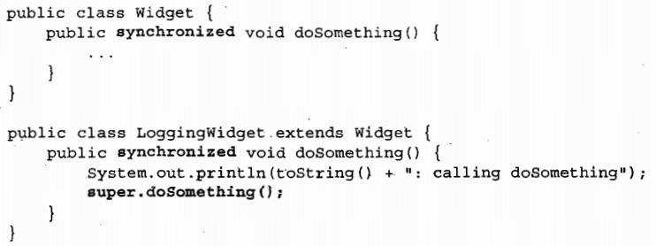

## 线程安全性

​		如果是正确的对象，在对其的任何操作中，都不会违背不变性条件或后验条件。

- **不变性条件**：由于约束对象的状态，对象的状态是指存储在状态变量（实例域或静态域中的变量）
- **后验条件**：描述对象操作的结果
- **线程安全性**：当多个线程访问某个类时，这个类始终都能表现出正确的行为，那么就称这个类是线程安全的。

## 原子性

- **竞态条件**：

  ​		当某个计算的正确性取决于多个线程的交替执行时序，这时就会发生竞态条件。此时就可能基于一种失效的的观察结果来做出判断或执行。常见的类型是 **先检查后执行** 的操作，即通过一个可能失效的观测结果来决定下一步的动作。

- **数据竞争**：

  ​		当一个线程写入一个变量，之后另一个线程读取变量，并且两个线程之间没有使用同步，这种情况就会发生数据竞争。
  
- **复合操作**：

  ​		将**先检查后执行**（延迟初始化）和**读取-修改-写入**（递增运算）等操作称为复合操作。

- **java.util.concurrent.atomic**：

  ​		此包中包含了一些原子变量类，用于实现在数值和对象引用上的原子状态转换，如可以用AtomicLong类代替long类型来实现安全的递增运算。这种方法只可以保证单个变量修改的原子性，多个变量的类型都是这个包中的类，这并不一定能保证不出错，因为不能保证同时修改这些变量。

- **内置锁**：

  ​		synchronized同步代码块，每次只能有一个线程可以执行代码块中的代码。

- **重入**：

  ​		获取锁的操作的粒度是**线程**，而不是调用，也就是说在同一个线程中，可以多次获取已获取的锁。

  ​		实现方法是用一个获取计数值和所有者线程。获取计数值用于统计获取锁的次数，获取锁时，JVM将记下锁的持有者，计数值加一，退出同步代码块时计数值减一，当此值为 0 时锁被释放。

  ​		以下代码中，每次子类执行 doSomething 方法时，都会获取父类的锁，然后再次调用父类中的此方法，再次获取锁。

- **类状态的保护**：

  ​		一个类的状态就是这个类中的变量，可以利用锁的机制来防止一个类的状态同时被多个线程修改。

  		1. 将可能被多个线程访问的可变数据进行加锁。
  		2. 若类有多个可能被多个线程访问的可变数据，则每个变量都必须由同一个锁来保护（因为锁是利用其只能被获取一次来实现同步的）。
  		3. 不可滥用锁。
