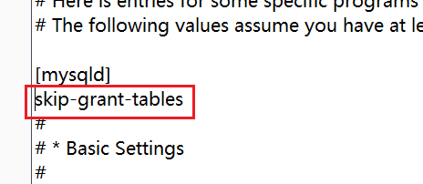

# mysql8首次安装密码设置

&emsp;&emsp;首次安装MySQL后，其实并不需要密码或随便输入一个密码就可以登录，如下

```
mysql
```

&emsp;&emsp;或

```
mysql -uroot -prandomPassword
```

&emsp;&emsp;用户默认为root

&emsp;&emsp;原因在于 mysql 数据库中的 user 表中 root 用户的 plugin 字段的值被设置为 auth_socket。

```
mysql> select user, plugin from mysql.user;
+------------------+-----------------------+
| user             | plugin                |
+------------------+-----------------------+
| debian-sys-maint | caching_sha2_password |
| mysql.infoschema | caching_sha2_password |
| mysql.session    | caching_sha2_password |
| mysql.sys        | caching_sha2_password |
| root             | auth_socket           |
+------------------+-----------------------+
```

&emsp;&emsp;当此值为 mysql_native_password 时才会用到密码。

&emsp;&emsp;所以要想使用密码登录 mysql 需将此值进行修改

```mysql
update mysql.user set plugin='mysql_native_password' where user='root';
```

&emsp;&emsp;然后使用如下命令

```mysql
flush privileges;
```

&emsp;&emsp;

&emsp;&emsp;mysql的此时user表的代表密码的 authentication_string字段 为空字符串。

&emsp;&emsp;所以在登陆时，可以使用以下命令

```
mysql -uroot -p
```

&emsp;&emsp;按下回车后，会提示要输入密码，此时直接再次按下回车即可登陆成功。

&emsp;&emsp;若想设置密码，不可以使用如下方法，此种方法在其他的博客中很常见，容易误导其他人。

```mysql
UPDATE mysql.user SET Password = password('password') WHERE User="root"
```

&emsp;&emsp;不能用的原因是，在mysql的user表的 authentication_string字段中的数据是加密后的密码，需要经过password()加密函数来加密，以上命令只在 mysql5 中适用。而在 mysql8 中并没有加密函数password()，取而代之的是 md5() 和 sha()，经过本人尝试，使用这两种加密函数都没用。所以不能用此种方法设置密码。

&emsp;&emsp;正确的方法是使用如下命令

```mysql
alter user'root'@'localhost' IDENTIFIED BY 'password';
```

```mysql
flush privileges;
```

&emsp;&emsp;

&emsp;&emsp;若忘记mysql密码，还可以使用**跳过权限验证**的功能

&emsp;&emsp;需要修改 mysqld.cnf 文件，我的电脑上的文件路径如下

&emsp;&emsp;/etc/mysql/mysql.conf.d/mysqld.cnf

&emsp;&emsp;在 [mysqld] 下加上 skip-grant-tables 即可



&emsp;&emsp;保存完文件后，再重启 mysql 服务

```mysql
 service mysqld restart;
```

&emsp;&emsp;再次打开时，直接使用mysql命令即可，如下

```
mysql
```


