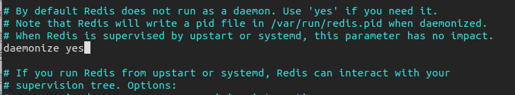

# Redis(Linux)安装

## Redis简介

​		Redis（==Re==mote ==Di==ctionary ==S==erver )，即远程字典服务。

​		是一个开源的使用ANSI C语言编写、支持网络、可**基于内存**亦可持久化的日志型、**Key-Value数据库**，并提供多种语言的API。与memcached一样，为了保证效率，数据都是**缓存在内存中**。区别的是redis会周期性的把更新的数据写入磁盘或者把修改操作写入追加的记录文件，并且在此基础上实现了master-slave（主从）同步。

​		可用作**数据库**，**高速缓存**和**消息队列代理**。它支持字符串、哈希表、列表、集合、有序集合，位图，hyperloglogs等数据类型。内置复制、Lua脚本、LRU收回、事务以及不同级别磁盘持久化功能，同时通过Redis Sentinel提供高可用，通过Redis Cluster提供自动分区。

​	

## 安装过程

1. 官网下载 https://redis.io/

2. 解压下载文件 redis-x.x.x.tar.gz到 /opt（linux的软件默认放在此文件夹）

3. 安装

   ```sh
   cd /opt/redis-x.x.x
   make
   ```

4. redis默认安装路径 `/usr/local/bin`，将解压目录中的 redis.config 文件复制到程序安装目录 `/usr/local/bin/redis-config`下，作为配置文件，源文件作为备份。

   ```sh
   cd /usr/local/bin/
   mkdir redis-config
   cp /opt/redis-x.x.x/redis.config /usr/local/bin/redis-config
   ```

5. **redis默认不是后台启动的**，需要修改配置文件

   将配置文件中 **deamonize后的 no变为 yes**



6. 通过制定的配置文件**启动redis服务**

   ```
   redis-server redis-config/redis.conf
   #./redis-server /root/redis-6.2.5/redis.conf
   ```

7. 使用redis-cli连接指定的端口号测试，Redis的默认端口6379

   ```
   redis-cli -p 6379
   ```

8. 关闭Redis服务 `shutdown`与 `exit`

   ```sh
   127.0.0.1:6379> shutdown
   not connected> exit
   ```

