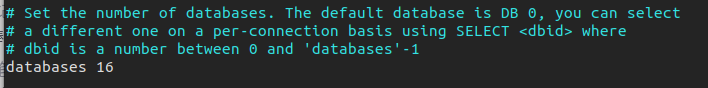
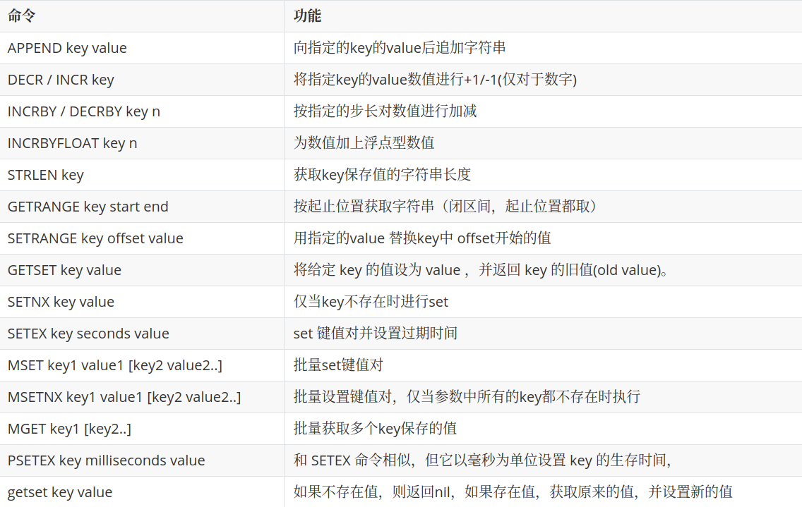
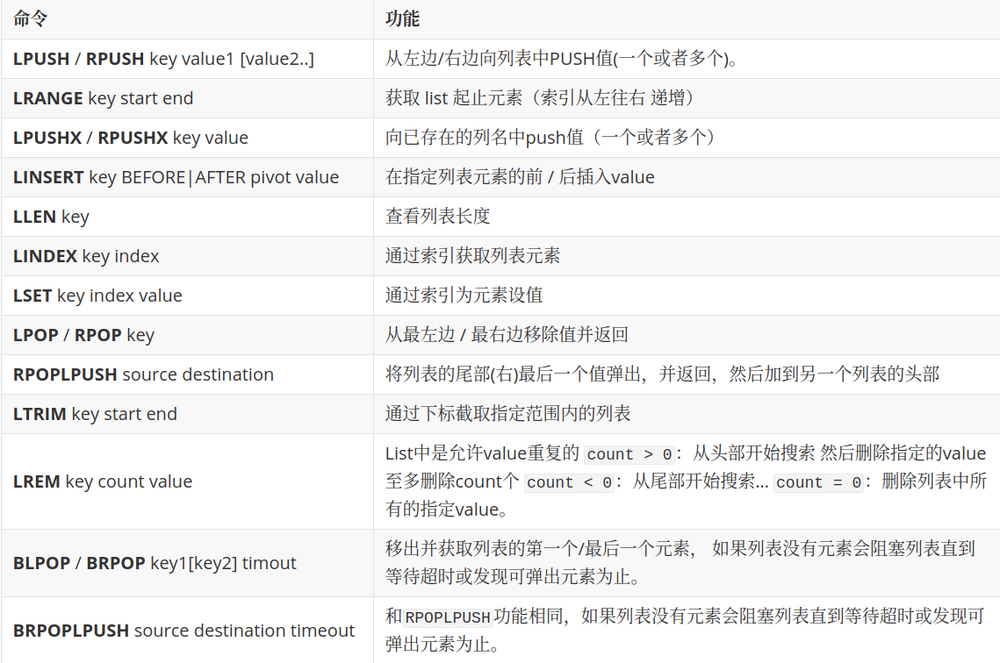
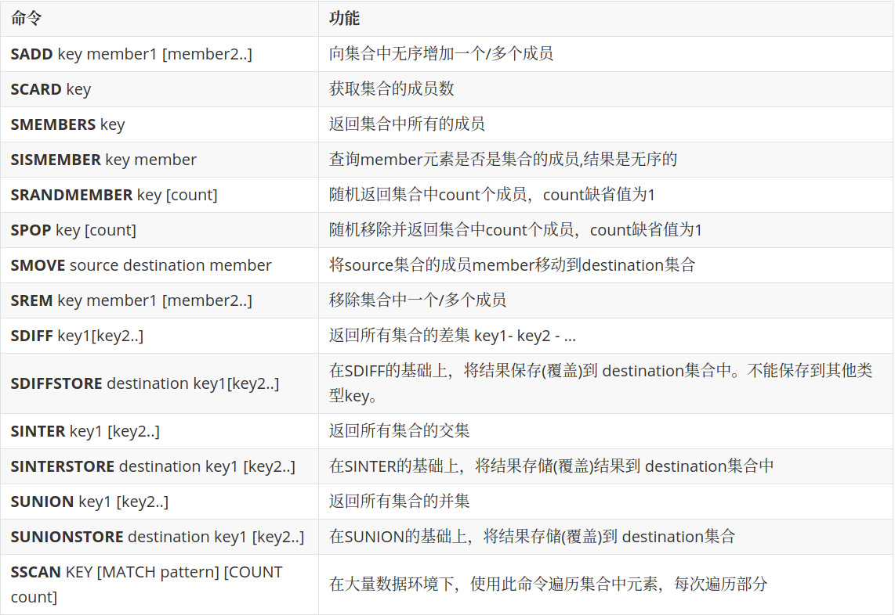
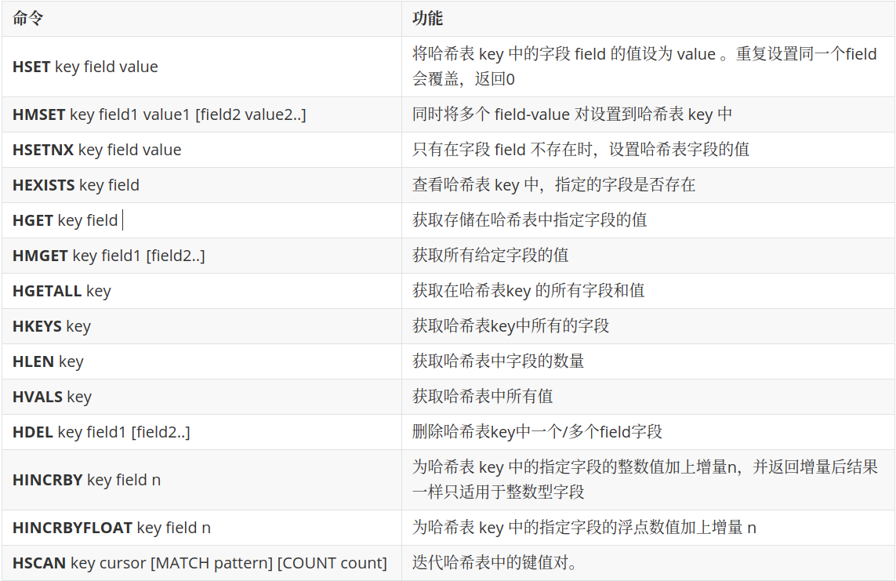
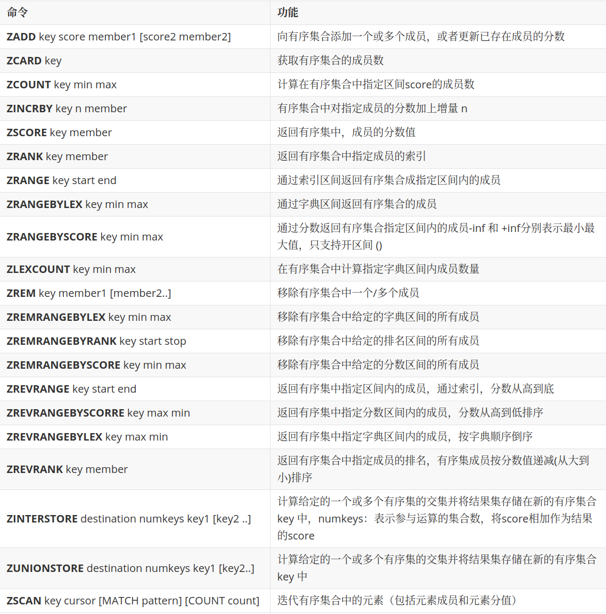
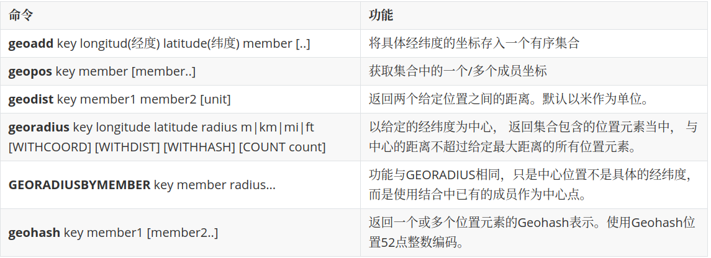
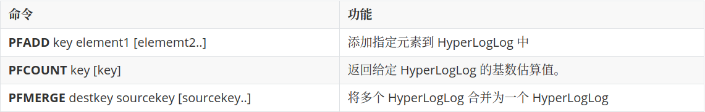
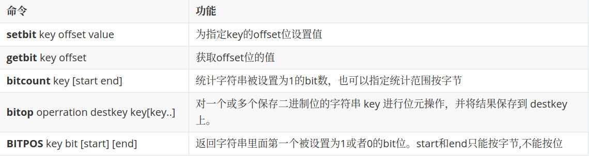

# Redis命令

## Redis基础命令

- **数据库相关命令**

  redis默认有16个数据库，默认使用第 0个。

  

  - **select n**

    可以切换到第 n个数据库，数据库索引从 0开始。

  - **dbsize**

    查看当前数据库大小，数据库大小是此数据库中 key的个数。

  - **flushdb**

    清空当前数据库中的键值对。

  - **flushall**

    清空所有数据库的键值对。

- **set key value**

  在当前数据库中**插入**一个键值对

- **exists key**

  判断 key是否存在

- **get key**

  根据 key在当前数据库中**获取**一个值

- **del key**

  根据 key在当前数据库中**删除**一个键值对

- **move key db**

  将对应 key的键值对移动到指定数据库

- **keys ***

  获取当前数据库中**所有的 key**

- **expire key second**

  设置对应 key的键值对的**过期时间**

- **ttl key**

  查看对应 key的键值对的过期时间。

  1. 当前key没有设置过期时间，所以会返回-1.
  2. 当前key有设置过期时间，而且key已经过期，所以会返回-2.
  3. 当前key有设置过期时间，且key还没有过期，故会返回key的正常剩余时间.

- **type key**

  查看对应 key的 value的数据类型

- **RENAME key newkey**

  **修改 key 的名称**

- **RENAMENX key newkey**

  仅当 newkey 不存在时，将 key 改名为 newkey 

## 五种基本数据类型

### String(字符串)

### List(列表)

​		Redis列表是简单的字符串列表，与链表相似。

### Set(集合)

​		Redis的Set是string类型的无序集合。集合成员是唯一的，这就意味着集合中不能出现重复的数据。Redis 中 集合是通过哈希表实现的，所以添加，删除，查找的复杂度都是O(1)。集合中最大的成员数为 232 - 1 (4294967295, 每个集合可存储40多亿个成员)。

### Hash（哈希）

​		Redis hash 是一个string类型的field和value的映射表，hash特别适合用于存储对象。Set就是一种简化的Hash,只变动key,而value使用默认值填充。可以将一个Hash表作为一个对象进行存储，表中存放对象的信息。

### Zset（有序集合）

​		不同的是每个元素都会关联一个double类型的分数（score）。redis正是通过分数来为集合中的成员进行从小到大的排序。

score若相同，则按字典顺序排序。有序集合的成员是唯一的，但分数(score)却可以重复。

## 三种特殊数据类型

### Geospatial(地理位置)

​		使用经纬度定位地理坐标并用一个**有序集合zset保存**，所以zset命令也可以使用

**有效经纬度**

- 有效的经度从-180度到180度。
- 有效的纬度从-85.05112878度到85.05112878度。

指定单位的参数 **unit** 必须是以下单位的其中一个：

- **m** 表示单位为米。
- **km** 表示单位为千米。
- **mi** 表示单位为英里。
- **ft** 表示单位为英尺。

### Hyperloglog(基数统计)

​		Redis HyperLogLog 是用来做**基数（数据集中不重复的元素的个数）统计**的算法，HyperLogLog 的优点是，在输入元素的数量或者体积非常非常大时，计算基数**所需的空间总是固定的**、并且只需花费 12 KB 内存，就可以计算接近 2^64 个不同元素的基数，但是有着 **0.81的错误率**。

​		因为 HyperLogLog 只会根据输入元素来计算基数，而不会储存输入元素本身，所以 HyperLogLog 不能像集合那样，返回输入的各个元素。其底层使用string数据类型
​	

**应用场景：**

​	网页的访问量（UV）：一个用户多次访问，也只能算作一个人。

### BitMaps(位图)

​		使用位存储，信息状态只有 0 和 1 Bitmap是一串连续的2进制数字（0或1），每一位所在的位置为偏移(offset)，在bitmap上可执行 AND, OR, XOR, NOT 以及其它位操作。

**应用场景**

​	签到统计、状态统计

