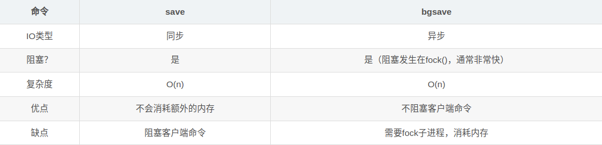
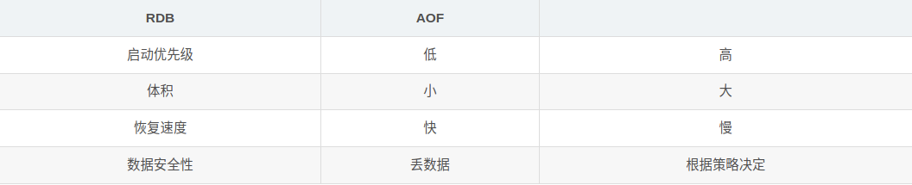

## RDB（Redis Databases）

​		在指定时间间隔后，将内存中的数据集快照写入数据库 ；在恢复时候，直接读取快照文件，进行数据的恢复 ；默认情况下， Redis 将数据库快照保存在名字为 dump.rdb的二进制文件中。文件名可以在配置文件中进行自定义。

### 工作原理

​		在进行 RDB 的时候，redis 的主线程是不会做 io 操作的，主线程会 fork 一个子线程来完成该操作；

1. Redis 调用forks。同时拥有父进程和子进程。
2. 子进程将数据集写入到一个临时 RDB 文件中。
3. 当子进程完成对新 RDB 文件的写入时，Redis 用新 RDB 文件替换原来的 RDB 文件，并删除旧的 RDB 文件。

​		这种工作方式使得 Redis 可以从写时复制（copy-on-write）机制中获益(因为是使用子进程进行写操作，而父进程依然可以接收来自客户端的请求。

### 触发机制

1. save的规则（配置文件中的 save）满足的情况下，会自动触发rdb原则

2. 退出redis，也会自动产生rdb文件。
3. `flushall` 命令也会触发持久化 ；

4. 使用 `save` 命令，会立刻对当前内存中的数据进行持久化 ,但是会阻塞，也就是不接受其他操作了；

   ​		由于 `save` 命令是**同步**命令，会占用Redis的主进程。若Redis数据非常多时，`save`命令执行速度会非常慢，阻塞所有客户端的请求。

   

5. `bgsave` 命令可以**异步**进行持久化，进行持久化的时候，`redis` 还可以将继续响应客户端请求 ；

### 优缺点

**优点：**

1. 适合大规模的数据恢复
2. 对数据的完整性要求不高

**缺点：**

1. 需要一定的时间间隔进行操作，如果redis意外宕机了，这个最后一次修改的数据就没有了。
2. fork进程的时候，会占用一定的内容空间。

## AOF（**Append Only File**）

 		快照功能（RDB）并不是非常耐久（durable）： 如果 Redis 因为某些原因而造成故障停机， 那么服务器将丢失最近写入、以及未保存到快照中的那些数据。 与 RDB不同，AOF则时将所有执行的命令都记录了起来，在恢复的时候执行这些命令。

​		由于默认使用的是 RDB，所以要在配置文件中将 appendonly后的 no 改为 yes 才可以使用 AOF。

### 优缺点

**优点**

1. 每一次修改都会同步，文件的完整性会更加好
2. 没秒同步一次，可能会丢失一秒的数据
3. 从不同步，效率最高

**缺点**

1. 相对于数据文件来说，aof远远大于rdb，修复速度比rdb慢！
2. Aof运行效率也要比rdb慢，所以我们redis默认的配置就是rdb持久化

## RDB 和 AOF 对比

