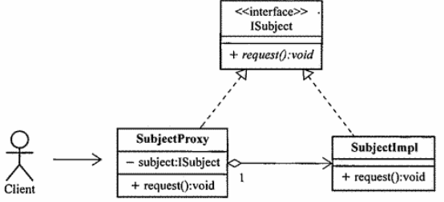

 

# Spring AOP的实现机制

## 代理模式

ISubject：该接口是对**被访问者**或者被访问资源的**抽象**

Subjectmpl：**被访问者**或者被访问资源的具体**实现类**

SubjectProxy：**被访问者**或者被访问资源的**代理实现类**

Client：代表**访问者**的抽象角色

​		代理对象 SubjectProxy 就像是 Subjectmpl 的影子，只不过这个影子通常拥有更多的功能。如果 Subjectmpl 是系统中的 Joinpoint 所在的对象，即目标对象，那么就可以为这个对象创建一个代理对象，然后将横切逻辑添加到这个代理对象中。

## 动态代理

​		若只是简单的使用代理，若不同的被访问者的接口虽然有相同的方法和横切逻辑，但还需要创建各自的实现类和代理实现类，依然较为麻烦，此时就可以使用动态代理。

​		先利用 java.lang.reflect.InvocationHandler接口来编写横切逻辑，然后利用 java.lang.reflect.Proxy类来创建动态代理生成的实现类，就可以利用动态代理实现 AOP。

## 动态字节码生成

​		因为动态代理需要有接口才可以自动生成实现类，但有些类没有接口，此时就需要使用动态字节码生成来实现AOP。

​		使用动态字节码生成技术扩展对象行为的原理是，我们可以对目标对分进行继承扩展，为其生成 相应的子类，而子类可以通过覆写来扩展父类的行为，只要将横切逻辑的实现放到子类中，然后让系 统使用扩展后的目标对象的子类，就可以达到与代理模式相同的效果了。可以借助CGLIB动态字节码生成库，在系统运行期间动态为目标对象生成相应的拓展子类。

​		如果Spring AOP发现目标对象实现了相应的Interface，则采用动态代理机制为其生成代理对象实例，而如果目标对象没有实现任何Interface，Spring AOP会尝试使用动态字节码生成。

