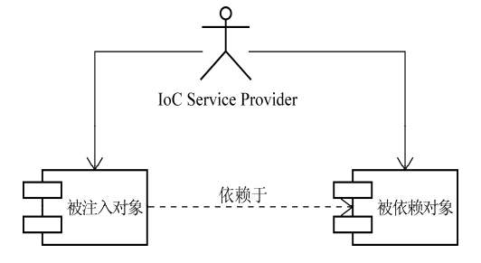

# IoC的基本概念

​		IoC 即 Inversion of Control，中文通常翻译为“控制反转”，它还有一个别名叫做依赖注入（ Dependency
Injection）。

​		被其他类依赖的类或对象，简称为“依赖类”、“依赖对象”

​		正常情况下，若一个类依赖于另一个类，则就会主动的在这个类中创建一个依赖类。而若使用IoC，则不需要我们去主动创建依赖类，IoC会将依赖注入到这个类中。

​		所有的**被注入对象和依赖对象都会由IoC Service Provider统一管理**。被注入对象需要哪个依赖类，直接通知 IoC Service Provider，后者就会把相应的被依赖对象注入到被注入对象中。**依赖类的控制权**由我们**变为了IoC Service Provider**，相当于是一种控制的反转。



## 依赖的注入方式

### 构造方法注入

​		被注入对象可以通过**在其构造方法中声明依赖对象的参数列表**， 让外部（通常是IoC容器）知道它需要哪些依赖对象。

​		IoC Service Provider会检查被注入对象的构造方法，取得它所需要的依赖对象列表，进而为其注入相应的对象。同一个对象是不可能被构造两次的，因此，被注入对象的构造乃至其整个生命周期，应该是由IoC Service Provider来管理的。

​		**优点：**

​				对象在**构造完成之后**，即已进入就绪状态，**可以马上使用**。

​		**缺点：**

​				1. 当依赖对象比较多的时候，构造方法的参数列表会比较长。而通过反射构造对象的时候，对相同类型的参数的处理会					比较困难，维护和使用上也比较麻烦。

​				2. 构造方法无法被继承，无法设置默认值。对于非必须的依赖处理，可能需要引入多个构造方法，而参数数量的变动可					能造成维护上的不便。


### setter 方法注入

​		当前对象只要为其**依赖对象所对应的属性添加setter方法**，就可以通过setter方法将相应的依赖对象设置到被注入对象中。

​		**优点：**

​				 1. 因为方法可以命注入依赖名， 所以setter方法注入在描述性上要比构造方法注入好一些。

​			 	2. setter方法可以被继承，允许设置默认值。

​		**缺点：**

​				对象无法在构造完成后马上进入就绪状态				


### 接口注入

​		从注入方式的使用上来说，接口注入是现在**不甚提倡**的一种方式，基本处于“退役状态”。因为它强制被注入对象实现不必要的接口，带有侵入性。而构造方法注入和setter方法注入则不需要如此。


### IoC Service Provider

​		IoC Service Provider 可以将这些相互依赖的对象绑定到一起。

​		IoC Service Provider在是一个**抽象出来的概念**，它可以**指代任何将IoC场景中的业务对象绑定到一起的实现方式**。它可以是一段代码，也可以是一组相关的类，甚至可以是比较通用的IoC框架或者IoC容器实现。


### IoC Service Provider的职责

####  业务对象的构建管理

​		在IoC场景中，业务对象无需关心**所依赖的对象如何构建如何取得**，但这部分工作始终需要有人来做。所以， IoC Service Provider需要**将对象的构建逻辑从客户端对象那里剥离出来**，以免这部分逻辑污染业务对象的实现。


#### 业务对象间的依赖绑定

​	IoC Service Provider通过结合之前构建和管理的所有业务对象，以及各个业务对象间可以识别的依赖关系，将**这些对象所依赖的对象注入绑定**，从而保证每个业务对象在使用的时候，可以处于就绪状态		


### 管理对象间的依赖关系的方式

#### 直接编码方式

​		可以通过程序编码的方式将被注入对象和依赖对象注册到容器中，并明确它们相互之间的依赖注入关系。像哈希表一样，被注入对象为键，依赖对象为值。

比如

```java
IoContainer container = ...;
container.register(FXNewsProvider.class, new FXNewsProvider());
container.register(IFXNewsListener.class, new DowJonesNewsListener());
...
FXNewsProvider newsProvider = (FXNewsProvider)container.get(FXNewsProvider.class);
newProvider.getAndPersistNews();
```


#### 配置文件方式

​		通过XML文件来配置，如：

```xml
<bean id="newsProvider" class="..FXNewsProvider">   
    <property name="newsListener">                   
    	<ref bean="djNewsListener"/>
    </property>
    <property name="newPersistener">
    	<ref bean="djNewsPersister"/>
    </property>
</bean>

<bean id="djNewsListener"
	class="..impl.DowJonesNewsListener"> 
</bean>

<bean id="djNewsPersister"
	class="..impl.DowJonesNewsPersister">
</bean>
```


#### 元数据方式

​		首先通过一个类来定义被注入对象和依赖对象，然后通过在被注入对象的**构造器上**加上一个**特定的注解**，来表明需要注入依赖。


