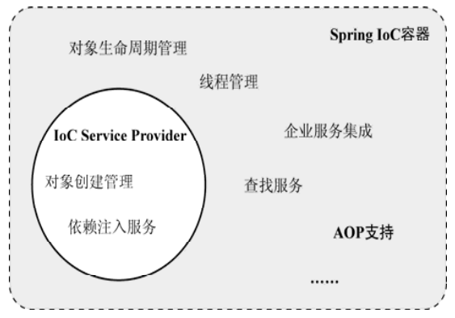
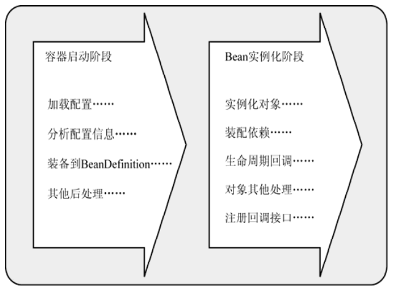
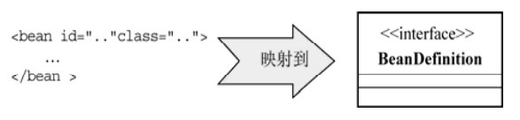

# Spring 的 IoC容器

### Spring IoC容器的种类

​		Spring的IoC容器是一个IoC Service Provider，除了基本的IoC支持，它作为轻量级容器还提供了IoC之外的支持。如在Spring的IoC容器之上， Spring还提供了相应的AOP框架支持、企业级服务集成等服务。 Spring的IoC容器和IoC Service Provider所提供的服务之间存在一定的交集。

​		Spring提供了两种容器类型： BeanFactory和ApplicationContext。

​		**BeanFactory：**

​		基础类型IoC容器，提供完整的IoC服务支持。如果没有特殊指定，默认采用**延迟初始化策略**（ lazy-load）。只有当客户端对象需要访问容器中的某个受管对象的时候，才对该受管对象进行初始化以及依赖注入操作。所以，相对来说，容器启动**初期速度较快，所需要的资源较少**。对于资源有限，并且功能要求不是很严格的场景， BeanFactory是比较合适的IoC容器选择。

​		**ApplicationContext：**

​		ApplicationContext**在BeanFactory的基础上构建**，是相对比较高级的容器实现，除了拥有BeanFactory的所有支持， ApplicationContext还提供了其他高级特性，比如事件发布、国际化信息支持等。ApplicationContext所管理的对象，在该类型容器启动之后，**默认全部初始化并绑定完成**。所以，相对于BeanFactory来说， ApplicationContext要求更多的系统资源，同时，因为在启动时就完成所有初始化，**容器启动时间较之BeanFactory也会长一些**。在那些系统资源充足，并且要求更多功能的场景中，ApplicationContext类型的容器是比较合适的选择。

### IoC的实现流程

​		控制反转的实现可以划分为两个阶段，即**容器启动阶段**和**Bean实例化阶段**。

​		在**容器启动阶段**，首先会通过某种途径加载Configuration MetaData。除了代码方式比较直接，在大部分情况下，容器需要依赖某些工具类（ BeanDefinitionReader）对**加载的Configuration MetaData进行解析和分析**，并将分析后的信息**编组为相应的BeanDefinition**，最后把这些保存了bean定义必要信息的BeanDefinition，**注册到相应的BeanDefinitionRegistry**，这样容器启动工作就完成了。

​		在此阶段，Spring提供了一种叫做BeanFactoryPostProcessor的容器扩展机制。该机制允许在容器实例化相应对象之前，对注册到容器的BeanDefinition所保存的**信息做相应的修改**。这就相当于在容器实现的第一阶段最后加入一道工序，让我们对最终的BeanDefinition做一些额外的操作，比如修改其中bean定义的某些属性，为bean定义增加其他信息等。

​		在**Bean实例化阶段**，容器会首先检查所请求的对象之前是否已经初始化。如果没有，则会根据注册的BeanDefinition所提供的信息实例化被请求对象，并为其注入依赖。如果该对象实现了某些回调接口，也会根据回调接口的要求来装配它。当该对象装配完毕之后，容器会立即将其返回请求方使用。

​		此阶段对于BeanFactory，对象实例化**默认采用延迟初始化**。通常情况下，当对象A被请求而需要**第一次实例化**的时候，如果它所依赖的对象B之前同样没有被实例化，那么容器会**先实例化**对象A**所依赖的对象**。这时容器内部就会首先实例化对象B，以及对象 A依赖的其他还没有实例化的对象。这种情况是容器内部调用getBean()，对于本次请求的请求方是**隐式的**。对于 ApplicationContext，在此阶段则会将所有的对象实例化。

​	

